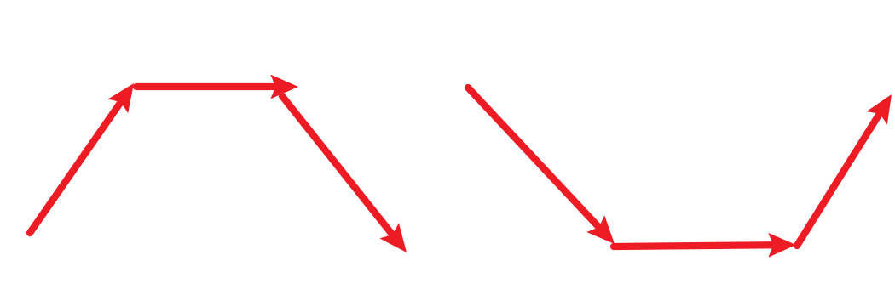
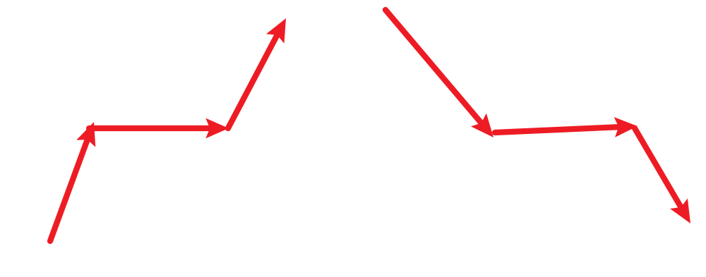
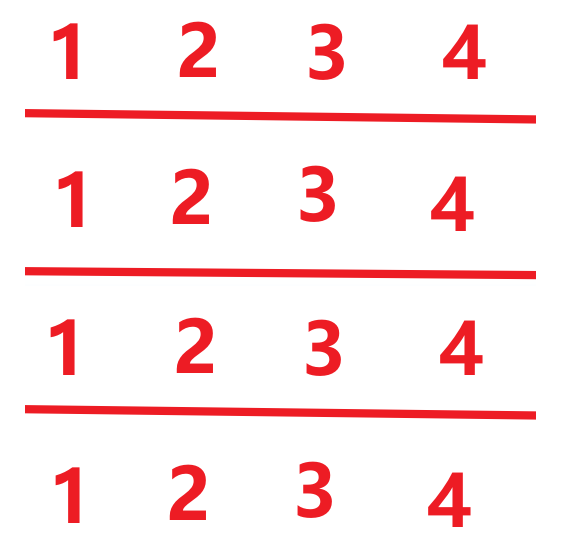

========================7.25========================

1.【122】买卖股票的最佳时机 II

​	这道题DP可以ac过；但是也可以贪心；这题贪心的思路很巧妙；股票一次买入和卖出，所得到的利润是可以分解为相邻两天的利润之和的，只是数学上，中间的过程都消掉了。以第零天买入，第三天卖出为例，利润 = prices[3] - prices[0] = (prices[3]-prices[2]) + (prices[2]-prices[1]) + (rices[1]-prices[0]) ; 所以就看出规律来了，实际上不管你中间经过了多少次买卖，即不管你经历了多少段，都可以微分下去，一直到相邻两天的买入和卖出。

​	都是由基本的相邻两天的利润构成的。既然是多只股票，那我就可以只挑正的利润就好了。也就是说，反正是多只股票，我只要挣钱我就加进去，只要遇到了亏损，我就卖出去。

​	代码就很好写了。借用一句大佬的话“相当于每天都在买卖”。

2.【53】最大子序和

​	这个最大子数组的和也可以dp，试试贪心。不会。看看题解。这个题目的贪心并不是很好想；这个题目的难点在于，连续子数组的最大和。你不能看到负数就收手，因为后面可能还有更大正数；而当下的负数以及之前已经收集的子数组之和还有可能大于0，即对结果有正向的作用。这就是这个题的难点。

​	我们可以用两个变量max_sum，一个是count，max_sum负责管理和迭代最大值，因为整个nums 的连续子数组的最大值出现在何处是不知道的。只能更新。而count就像是游历变量；负责管理和记录当前收集的情况。只要count还>0，它就会继续收集，但是count不会是最后返回的结果。因为count游历到最后，不一定是全局最优解。只能说是大于0的**<u>一个解</u>**.所以才需要max_sum来管理最大值。

​	只要发现count>max_sum，就可以更新一次max_sum；而count的更新规则是，先加上，只要count还有希望（count > 0），就不做处理，只要发现<0，那就置0；

​	而max_sum是管理最大值的，存在所有数都是负数的情况，所以你不知道max_sum有多小，也不一定是正数；所以初始化为最小数。

代码如下：

```c++
class Solution {
public:
    int maxSubArray(vector<int>& nums) {
        int max_sum = INT_MIN;
        int count = 0;
        for(int n : nums) {
			count += n;
			if(count > max_sum) {
				max_sum = count;
			}
			if(count < 0) count = 0;
		}
		return max_sum;
    }
};
```

3.【376】摆动序列

​	看看题解。这个题目的难度真的不小。因为考虑的东西很杂乱。判断峰值只是一种直观的解题的大概思路。但是要兼顾很多细节。比如如何处理平坡，平坡也会分为几种情况。包括端点如何处理。

​	本题中我们需要计算当前便利点的前面和后面的gap，如果gap>0说明是上坡，如果小于0说明是下坡，如果等于0说明是平坡。

​	本题的特殊情况有三种：①上下坡中有平坡，形如下图。这种情况算平坡只算一次峰值；而且平坡可能会很长。所以我们不应该时时刻刻更新preDiff，应该让prediff记录在上坡或下坡的位置，然后让curDiff去游历，它可能为0可能为正可能为负；这种平坡的，只有到了右侧的拐点，才会让ret++；换句话说，只要看到curDiff为0，就不会让curDiff++；而且当遍历到右侧拐点的时候，curDiff不为0了，**<u>而且之前没更新的preDiff也不为0（因为curDiff为0的情况下，不会更新峰值，也不会更新preDiff，除非初始化的时候preDiff=0，没办法，所以判断的条件的地方才会让preDiff的不等号加上等于号）</u>**，就可以用判断峰值的条件判断了，但是此时要更新preDiff为curDiff了，现在的判断峰值的条件是`if(preDiff<=0 and curDiff>0 or preDiff>=0 and curDiff<0)`



​	②上坡或者下坡的过程中遇到了平坡；如下图所示。在上面的条件中，这种情况包含在内。平坡的左侧拐点，curDiff=0所以不会++，也不会更新；平坡的右侧拐点，因为preDiff>0，所以也不会更新。以左边的为例，因为如果第一个点是真实的左边界，那就会在这里更新一次。preDiff会变成curDiff的值，即一个大于0的数，显然不会在平坡的右边++并更新preDiff；如果前面存在一次极小值，那么preDiff也同样会被更新为大于0的数，不管怎么样，这种情况下，preDiff一定是大于0的数。



​	③边界。如果整个序列是非严格单调的，返回2才对；按照我们之前的逻辑，中间是没有峰值++的；但是这种情况不同于所有数都相同的序列，那种算1；所以应该让整个序列的峰值数初始化为1，然后在第一次不水平处更新一次。即preDiff应该初始化为0，因为你也不知道curDiff第一次不水平遇到的是上坡还是下坡，反正判峰值的条件里面的preDiff那里都有=0的部分。

​	分析完毕。

4.【455】分发饼干

​	分析：有几个饼干，几个孩子；现在一个孩子最多吃一个饼干。有孩子的胃口值，饼干补充的饥饿值；现在求最多满足多少个孩子的胃口。

​	我最直观的想法就是贪心，把胃口和饼干都降序排序一下。然后我分发饼干。先分发大的饼干，直到找到第一个可以吃了这个大饼干就满足的孩子，之前那些大胃王我就不用管了，因为下面要分发的小饼干肯定无法满足这些小馋猫们的胃口了。所以外层是遍历饼干的。但是内层肯定不能是for循环了。必须用一个idx来代表当前遍历到哪个孩子了。对于每一个饼干，我只需要从上一次的idx处开始询问“你够不够吃”。那很显然，最后孩子遍历完毕的时候，剩下多少饼干，我就返回多少。或者最后饼干遍历完毕，我只就return 饼干的size就可以了。

​	还有一种策略：就是遍历孩子，但是我不太好理解。我这种也ac了。

注意事项：

​	要注意，跳过那些大胃王idx需要++，喂一个孩子也需要手动idx++，不要丢掉这种情况。

5.【1005】K次取反后最大化的数组和

​	真的很简单的一道题目；关键就是先升序排序，尽最大努力把绝对值大的负数先求相反数；出来之后比一下k是不是大于0，就知道负数和k谁多了。

​	有点细节就是循环的条件不要非法就行。而且这种排序的思路是最好的贪心思路了。

6.【738】单调递增的数字

​	分析：这个题目，肯定不能暴力。我们用贪心。如果从前往后遍历，显然是不行的；因为一旦发现两个数组是单调递减的，必然要把右侧的数改为9，而不能在左侧的基础上+1，因为要找到 <= 原数字的单调递增的新数。而右侧一旦改为9，左侧就要-1；左侧变小，可能就会影响更左侧的状态。所以必须从右侧往左侧遍历。

​	但是代码不太好写。主要是遇到0的情况。你不知道改哪位，而且你改了一次，整体仍然可能也并不符合条件。很显然,在某种情况下应该是从某一个位置后面都是9，**<u>因为只要出现了非单调递增的数对，就必然要涉及到置9，那么这个9后面也必然是9.</u>** 我们不妨找到一个位置，最后再统一置9.

​	那这个位置是什么位置呢？不太好一次就确定，因为我们是从右侧往左侧检查的，不可能第一次出现的位置就是最后的结果，应该flag是不断迭代到最左侧的。

​	所以代码就比较好写了；就是不断迭代idx到最左侧。但是每一次你就当做最后一次，修改一下左侧的值，让
它--，而且你不需要担心越界，因为递减的情况必然不会越界。

注意事项：

​	不要让idx_9初始化为最后一个，因为默认是不会出现逆序的。

7.【968】监控二叉树

​	这是一道hard题，而且我之前没有挑战过。我看了题解理解了。

​	这道题目的关键在于叶子节点肯定不会装，因为叶子肯定有父节点，把这个任务交给父亲就可以了；在叶子结点上装就是浪费。而且叶子的数量要很大，产生的影响远大于一个根节点，所以是自底往上遍历的，即后序遍历。

​	我们需要一个全局变量来控制监控的数量，所以在类内声明一个属性ret来管理监控的数量。

​	确定后序遍历之后，我们就要思考如何贪心让结果最小：为了让结果不多余，即降低同一个节点被重复照亮的可能性，即每个节点最好只是被一个监控照亮。那么我们设置三种状态，并且让递归返回当前节点的状态才可以方便判断。一个节点有三种状态：①我自己就是监控；②我被间接照亮； ③我还没有被照亮。 这三种状态分别用1和2和3管理。

​	递归函数可以这样写：如果是空，完全不用担心空的状态，return 2； 如果我不是空，后序遍历；如果我是叶子，即左右孩子都是2，这种判断条件也间接说明了，如果我的左右孩子都已经被间接照亮，那么我也不需要担心装监控，这个时候不管我是不是叶子，还是说我的孩子们都被间接照亮，装监控的都不应该是我，否则就浪费了，即我的孩子们都会被重复覆盖。所以return 3，即我还没被照亮，需要被照亮。如果我的左右孩子**只要有一个**状态是3，那意味着我必须装监控了，因为他们就我一个父亲，如果我不装监控，它们就不会被覆盖到了。 其他情况都返回2，即间接照亮状态。

​	主函数的地方要判断root传入进去是不是3状态，如果是，需要ret++，即额外关心一下树根，因为树根可能没有被照亮。即是状态3的情况-因为root没有被父节点照亮的机会了。

​	就不难写出代码了。

===========================7.26===============================

0.回溯综述

​	回溯的时候脑子里要时时刻刻有一棵类似于树的东西，如：



​	思考问题要纵向和横向，纵向是递归，横向是for循环的遍历；这其实是一颗树；但是没有树根。因为对于回溯暴搜索来说，既要纵向考虑如何递归，递归出口怎么样，如何管理传参，是否需要去重；也要横向考虑，是否需要去重，每一层的处理个数问题等等。

1.【77】组合

​	给我一个n，一个k；从【1，n】这几个数中取k个数，让我返回所有的组合结果。优先考虑暴力的做法，比如n = 4，k = 2，第一步我可以选C~4~^1^,第二步我可以选第一次数后面的数，即我确保第一次数选择的比第二次要小都是可以的。这在一棵暴力的逻辑树中，第一个数可以从任何数开始，然后后续k个只需要保证递增即可。

​	backtracking函数的入参需要有收集结果的ret和一条路径的path；需要有从1到n的nums，也需要有这次研究开始的下标index；核心就是在遍历这棵树。

注意事项：

* 【关于剪枝】就算不剪枝，能过就行；有时候没必要过分优化，性价比不高。至少对于小白没必要，能ac就不错了。
* 【ret和path的位置的问题】backtracking的ret和path可以作为类内属性，从而简化代码。
* 【处理本节点逻辑的位置的问题】递归出口一定是path的size和k一样大才会出去，而且大部分情况下，单层的逻辑是是直接for循环遍历一层。每一轮循环先处理结点，然后递归，再回溯。 小部分情况是需要先整体处理结点，然后循环递归下去。至于这个题目为什么是在for里面处理 + 递归 + 回溯，**因为这个逻辑树不算一棵严格意义上的树**。因为第一轮有n-1种选择。所以没有树根。就只能直接遍历第一层。

2.【216】组合总和III

​	什么时候要想到回溯呢？就是要**严格记录过程（要返回中间结果的）**，而且要遍历，基本上都需要回溯，而且数据量不算大，暴力不会超时；如果不需要过程，只问种类数，那可能可以dp。

​	给一个k，给一个n，要求k个数之和为n的所有组合的情况，而且这k个数只能从1到9挑选，每个数最多用一次。k的范围是2到9，n的范围也不大。显然这个题和组合是类似的，只是搜索的时候加了一个判断-之和如果是n，我才放入ret。代码大差不差。

​	直接100%ac了。

3.【17】电话号码的字母组合

​	这个题的花样在于，虽然是组合问题，但是给一个字符串，相当于k知道了，即递归树的深度知道；第二个花样是每一个数会代表一个集合。这就意味着要到不同的容器中遍历，自然需要多个索引。很容易想到，递归树的每一层，其实就是对应层的数对应的字母的集合。可以试着套一下模板，看看会有什么问题。这个题和上面两个题的最大不同应该是：由于每一层不是同一个集合，所以for循环应该从0开始；然后idx也得传idx+1,因为idx的作用主要是负责管理每一层代表的数字的在原digits的下标，这样方便我映射到对应的字符串。还有就是空串单独处理一下。

4.【39】组合总和

​	给定一个无重复的nums，和一个target；每个元素可以无限次利用；求所有的组合数；规模量不大，可以暴力；但是每一个结果都不确定有多少个，所以for循环暴力是不可以的。只能回溯。

​	回溯，这里一个元素可以用多次。所以每次for循环开始就很有讲究了。既不是从0开始，因为我们要逐步缩小考虑范围。所以还是逐渐减小的。但是，下一次还是要考虑到自己的。所以唯一的不同是，我要传入i作为递归树下一层的startIdx；而不同层，靠最开始的那个for循环的i来控制idx即可。

​	第二个区别是，递归出口；每一次都要检查sum是不是==target，题目保证nums[i]>=2，所以还可以剪枝。try it。直接ac了，挺简单的。

5.【40】组合总和II

​	不要轻视重复元素！

​	这个题和上面39题的唯一区别就是，nums中允许出现重复的元素，而且只能用一次。区别就是递归调用的时候传参数startIdx的时候要传i+1就好了。别的没有区别。

​	注意事项：还是有点问题的，问题主要是出现在重复元素，不允许重复。比如7,1和1,7其实这两个1不是同一个；但是结果上来看要去重。从样例的预期结果上来看，应该是要先sort的。然后对于相邻的重复元素，要剪枝。第一个不剪枝，因为可能需要重复元素同时作为一个结果之一。但是第二个就没必要遍历了。即去重逻辑是在for循环的时候，择机continue就好了。

​	但也没那么简单，因为我们希望纵向来看，不随意continue（因为纵向是在遍历一棵树，肯定不能随便去重）；而只是横向continue就好了（对于同一层来说，可以把不是第一次出现在本层的节点continue掉）。如何做到这一点呢？那就是要确保i>=startIdx+1就好。ok，100% ac了。

===========================7.27==========================

1.【131】分割回文串

​	分析：规模不大，而且返回中间过程，考虑回溯。这显然是切割的问题，关键是不知道从哪切，以及不知道切几刀的问题。懂了，第一层递归的for循环我就遍历第一刀的位置，第二层我就遍历第二刀的位置。以此类推。我每次遍历之前，我都应该判断一下上一刀和这一刀之间的字符串是不是回文的，如果不是，直接剪枝。所以我还需要规定区间的开闭。我可以规定是闭区间。

​	try it。

注意事项：string的copy构造函数是左闭右开的，所以传入迭代器的时候要注意。可以优化的点在于可以用回文这个性质进行剪枝；

2.【93】复原IP地址 - 要考虑的细节还是太多了

​	分析：规模不大，而且返回中间结果，考虑回溯。该题的核心在于不能删减，不能排序。只是插入三个点，而且不考虑在最开始和最结尾插入点。

​	感觉和分割回文子串类似，这个题要更简单。因为可以确定的是分割为四个部分。而且保证每一个部分转int保证在0到255之间就可以了。而且收集要更简单。

​	try it。

注意事项还挺多的：

* 注意返回的格式-主函数中要自己组织数据格式；
* 递归出口：当path.size() == 3的时候就要准备出去了，手动处理最后剩下的那个，要检查几点
  * 是不是空串；
  * 0开头的特殊检查；
  * 是不是太长，或者不长但是转int超过了255；
* 一般的逻辑，要先检查s[startIdx]是不是0，如果不是才继续，如果是就单独处理了，而且递归传入的startIdx就是startIdx+1而不是基于循环的i了，因为要确保不是0开头的。
* for循环的条件，必须要横向剪枝确保每一个部分不会超过3个字符； // 最后一部分是在递归出口单独处理的逻辑；如果不剪枝转int会上溢出。

3.【78】子集

​	这种题就是组合问题的开放版本，对每一个path的大小不加以限制；可以一边遍历一边收集。我看结果都是有顺序的，先不sort看看能不能过，如果不能就得sort了。

​	try一下回溯-还是判断能否回溯的条件很明确：①数据规模不大； ②需要中间结果。

​	挺简单的，都是最基本的；最基础的就是，不需要递归出口；每次先收集结果就行，如果startIdx超过了，for不执行就是了。

4.【90】子集II

​	可能有重复元素，所以得考虑去重的问题。还是得保证是sort过后的。然后第一轮是不需要去重的，但是for循环的时候第二个相同元素就没必要再遍历了。而且纵向不需要去重，但是横向需要。

​	横向去重的手法是for循环内部，只有满足一定的条件才可以递归，否则不让你递归。ac了；

5.【491】非递减子序列

​	数据量不大，而且考虑中间结果，所以考虑回溯；注意细节至少两个才算序列，而且相同元素也可以按照递增处理。整体还是暴力回溯+剪枝；**【核心】遇到当前元素比path的要更小，那就没戏了**。只要你的path的size比2大，随时都可以收集-前提是path不为空，否则会越界。

​	这个题目的最大难点在于**去重**，首先肯定是不能sort的-子序列问题；其次，你的去重肯定不能用之前相邻跳过的思路了，就必须对**每一层用一个hash来记录是否访问过了**。

6.【46】全排列

​	数据量不大，需要中间过程，选回溯；想想排列的过程，想想递归树的逻辑；肯定是n层；第一层就相当于给第一个位置挑选；然后第二层就要想办法避开上一层已经挑选过的；第三层就要避开第一层和第二层已经挑选过的；所以我感觉需要维护一个动态的哈希ump；然后回溯的时候记得给它也回溯一下。

​	这样就可以了。每一层都要从0开始遍历，注意用ump剪枝就好。

​	直接ac了；要注意这里全局mp的作用是纵向去重。和针对每一层的横向去重ump是不一样的。

7.【47】全排列 II

​	数据量不大，需要中间过程，考虑回溯。但是本次是有重复元素的，考虑如何去重。全排列问题纵向是要去重的，但是和无重复元素的略有不同，就是判断条件不一样了。不能只看这个元素有没有在使用。而是确实要点对点的去重，即`mp[i]++`，即用下标对应nums的下标看看是不是正在占用了。横向也是需要去重的。因为整体不是升序的，不能保证相同元素是挨着的，所以必须也要用mp面向每一层去重。

​	ac了。

