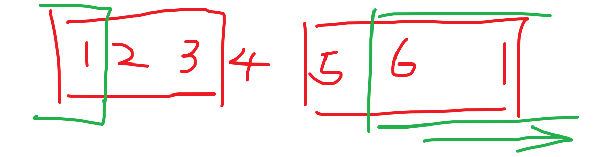
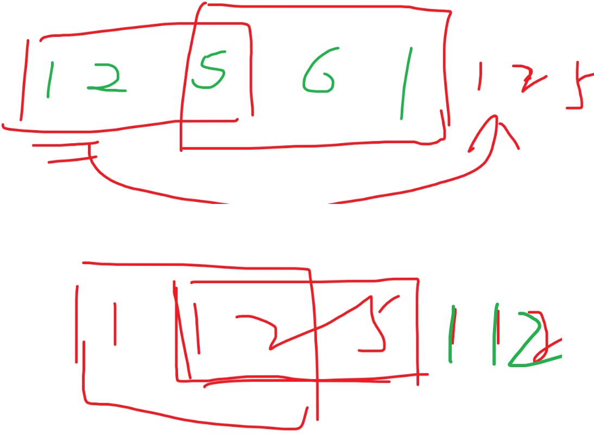
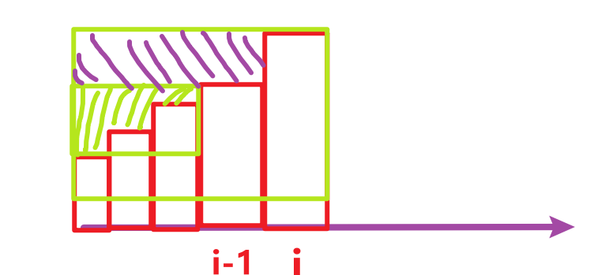
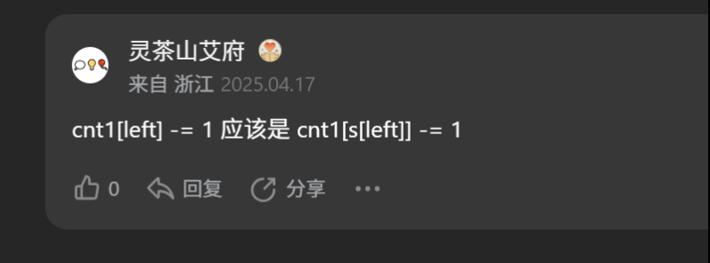
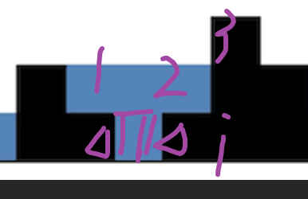
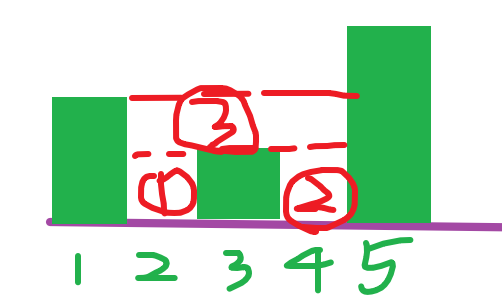
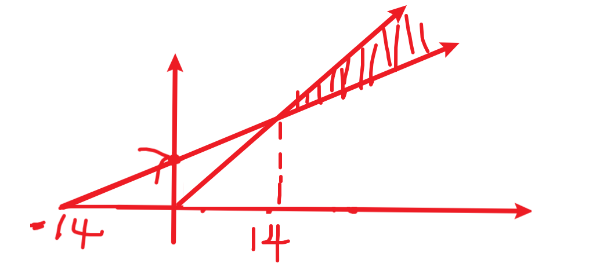

[[分享丨【算法题单】滑动窗口与双指针（定长/不定长/单序列/双序列/三指针/分组循环）- 讨论 - 力扣（LeetCode）](https://leetcode.cn/discuss/post/3578981/ti-dan-hua-dong-chuang-kou-ding-chang-bu-rzz7/)](https://leetcode.cn/discuss/post/3670978/ling-shen-ti-dan-yu-gong-si-bi-shi-ti-de-eh4x/)

-- 这周是**大厂面试高频考点**，来自上面大佬整理的题单。都是历史真题。八月份剩下的三周就写这个。

-- 本周写灵神的滑窗题单

# 定长滑动窗口	

=================8.6==============

1.【1052】爱生气的书店老板

​	分析：minus的大小的窗口一直滑动，窗口内的顾客肯定满意，满意的顾客还要包含窗口之外不生气的；所以包含两部分。我们可以遍历整个数组，然后每一个地方都求一个满意的人数，最后迭代一个最大值。这是暴力的方式。

​	显然暴力超时了。我们可以这样想，整个过程，老板不生气的时候的顾客一定是满意的，不管这个不生气是不是在我的窗口内，都是不生气的，都是可以独立计算的，而生气的就是反动派，我们要让反动派最多出现在窗口内，即让老板生气的时候，而且顾客最多的时候老板抑制自己的脾气就好了。

​	所以问题转化为两部分，一部分正常求顾客人数-本来就不生气的时候。一部分是窗口内的生气的时候，要让生气的时候的人数达到最大值，显然这也是我们需要团结的力量。

​	遍历窗口肯定是O(n)，我们争取一次遍历解决问题。我们可以用一个两个元素的数组，0索引代表整个过程的本来就就不生气的顾客人数的计数器。1索引代表窗口内生气时的顾客人数的计数器。我们从0开始到n-1都需要收集；我们滑动窗口要做的是站在窗口右侧的角度处理，即如果i太小，我们就continue；如果到了窗口的右侧边沿，我们就尝试更新全局的max_val-窗口内生气的人数，然后才是滑动的过程，一旦滑动，我们就需要更新s[1]-即窗口内生气人数，前提是刚刚离开窗口的是生气的我才需要减去它。

​	最后返回s[0] + 全局窗口内生气人数最大值。

​	初次接触还是挺难的。这个问题的难点在于：①生气和不生气独立分开计算；②滑动窗口解决生气人数的最大值，最后两部分加起来。我们窗口内只需要维护生气的人数就好了。其实还是需要全局变量来记录整个滑动过程中的生气人数最大值的。

​	自己写一下代码。

问：如何理解窗口滑动的时候的那句代码？

答：由于第一个窗口的右边沿就已经累加出来此时生气的状态了，所以就可以更新全局最大变量了；所谓窗口滑动，是来到每一个合法的地方就立刻加上这个状态，这可以理解为窗口右移时处理右边沿新加进来的状态。而-=的代码是让左边cut掉，是为下一次的窗口滑动作准备。

​	至于顺序为什么要这样安排？右侧 -> 更新 -> 左侧这样的滑动过程。你可以理解为，我来到一个新的窗口右边界，我需要加上这个新值，我就可以立刻更新了，因为我的左边界在上一轮循环已经帮我处理（-=）好了。

​	其实按照常规思路，应该把右边界和左边界的处理挨着处理，然后再更新全局最大值变量，这样符合常理。但是这样的坏处是边界的窗口需要单独拎出来讨论，否则会造成数组越界。就像第一个窗口没有上一个窗口，那就需要单独处理。显得很麻烦。倒不如颠倒一下顺序。每一次到达新的窗口右边界，就加上右边，此时就已经是新的、长度为minute的窗口了。这样就可以更新。然后在本轮循环的最后进行左边界的cut，为下一轮循环做准备。

```C++
class Solution {
public:
    int maxSatisfied(vector<int>& customers, vector<int>& grumpy, int minutes) {
        int max_grumpy = 0, s[2]{};
        for(int i = 0;i < customers.size();i++) {
			s[grumpy[i]] += customers[i];
			if(i < minutes-1) continue;
			max_grumpy = max_grumpy > s[1] ? max_grumpy : s[1];
			s[1] -= grumpy[i-minutes+1] ? customers[i-minutes + 1] : 0;
		}
		return max_grumpy + s[0];
    }
};
```

2.【438】找到字符串中所有字母异位词

​	分析：给我一个s串，一个p串，要求找到s中所有的p的字母异位词。返回他们的起始索引的数组。

​	如果暴力，时间复杂度是O(n^2^k).但是由于是字母异位词，所以子串的长度知道，即我只需要遍历一遍，就可以对寻找子串的过程进行剪枝，所以暴力的复杂度可以优化到O(nk)，还是太慢了。既然子串的长度固定，就让我想起了固定的窗口的滑动。遍历的过程，携带一个长度为len(p)的窗口。尝试用滑动窗口解决。

​	我们可以先试试笨方法，每次窗口当判断都用一个26的hash，也相当于是O（1）判断吧。其它的操作类似于滑动窗口的模版了。写一下代码。

​	心得：其实还是按照灵神的专题刷题比较好，这样效率很高，巩固也很强。一个题kei明白之后，所有的基本都是一个套路。一天刷十道题没问题。【1052】已经是比较难的滑窗了，如果这个题学会，其它应该问题不大。就让1052是一个模版题目吧。多看题解还是有好处。这个题我就是独立写出来的。按照灵神的题单和题解刷算法，真是享受。十点半去洗澡。

3.【1456】定长子串中元音的最大数目

​	长度固定的子串，很显然是滑窗的模版题目了。本题给我一个窗口大小k，要求找到给我的s的大小为k的子串中的最大元音字母数。模板题了。

​	自己ac了，但是我看到灵神的这个题解关于离开窗口的注释是最清楚的 -- “为下一轮循环做准备”，附上灵神的代码。

```c++
class Solution {
public:
    int maxVowels(string s, int k) {
        int ans = 0, vowel = 0;
        for (int i = 0; i < s.length(); i++) {
            // 1. 进入窗口
            if (s[i] == 'a' || s[i] == 'e' || s[i] == 'i' || s[i] == 'o' || s[i] == 'u') {
                vowel++;
            }
            if (i < k - 1) { // 窗口大小不足 k
                continue;
            }
            // 2. 更新答案
            ans = max(ans, vowel);
            // 3. 离开窗口，为下一个循环做准备
            char out = s[i - k + 1];
            if (out == 'a' || out == 'e' || out == 'i' || out == 'o' || out == 'u') {
                vowel--;
            }
        }
        return ans;
    }
};
```

4.【643】子数组最大平均数 I

​	分析：长度固定是k的连续子数组-定长的滑窗，求什么花样都是一样的，求的是窗口的平均值，本质上就是求最大和。模版题。别看通过率只有44%，但是如果你掌握了滑窗的模版思想，你就会一分钟一气呵成秒掉这个题目。就这么简单。这就是刷题的正确方法-“**不会永远痛苦**”。

5.【1343】大小为K且平均值大于等于阈值的子数组的数目

​	分析：给我k，给我阈值。让我返回整个arr的大小为k且均值大于阈值的子数组的数目。大小为k的固定子数组一定是定长滑窗解决。维护一个窗口中的sum，然后每次处理的时候，就尝试让均值和阈值比较，尝试更新cnt；模版题。果然灵神的题解和我一样了哈哈。开心~

6.【2090】半径为k的子数组的平均值

​	分析：花里胡哨的，本质上窗口大小就是2k+1，然后滑动窗口，处理的逻辑就是求截断平均值放入arr就行了。模版题。

​	注意事项：会超过int的范围，改成uint_64维护sum就行。第二个注意事项是初始化为-1，会节省很多精力。

7.【2379】得到K个黑块的最少涂色次数

​	模版题。用一个计数器统计窗口内的W的数量，然后每次处理都更新全局的min_w，最后返回就行。

8.【2841】几乎唯一子数组的最大和

​	首先要理解几乎唯一子数组的内涵是内部至少有m个互不相同的元素的子数组。关键是我们在处理的时候如何判定当前窗口是几乎唯一子数组。我们可以维护一个长度为k的hash，每次都遍历一遍这个hash，看看不为0的元素是不是满足个数>=m；如果是，我们才尝试更新最大和。复杂度是O(n * k);想一下是不是可以优化判定呢？

​	我们可以反着想，几乎唯一子数组也可以理解为相同元素的个数不超过k-m，这样我们一边遍历，一边维护一个visited；如果出现过，我们就让cnt++；这样就避免了每次都遍历hash。

​	这个题有点复杂的，我们做题的时候脑子要保持清醒，尤其是下标的含义时刻要铭记。离开窗口的时候和加入窗口的时候处理的变量有点多。写个题解吧。

9.【2461】长度为K的子数组中的最大和  

​	分析：本题类似。

10.【1423】可获得的最大点数

​	这个题也是滑窗，但是不是一眼看出来的，因为只能从最开始和最后面摸牌，但是整体上来看，你摸牌的这些牌都是连续子数组的一部分。但是不同的是，这个子数组比较特殊，首尾的地方是连续的，而且你必须从第一个开门或最后一个开门，即子数组必须包含这两个元素中的其一。从这个意义上来看，我们可以想想一下，把首尾拼起来构成一个“环”，而且滑动窗口滑动的范围是有限的。

​	所以我们可以重新构造一个nums，把问题转化为我们熟悉的问题，如下图所示：



​	所以我们只需要把两侧一共2k个元素按照5 6 1 1 2 3 这样的顺序，构建一个新的数组即可。当然我们不排除原本的数组就很小的情况（nums.size() < 2k），那怎么构建呢？



​	看这个例子就知道了，哪怕首尾的重叠也不要紧，把头k和尾k调换顺序拼起来正常遍历就好了。只要不是一共k个的情况都需要如上处理。

​	100%ac了，关键是要知道先放尾k个，再放头k个。

**<u>=> 这个题也可以逆向思维。两头拿的问题都可以变成中间取的问题，这样更简单。</u>**

11.【1652】拆炸弹

​	这个题也用到了循环数组，上面我们处理循环数组的方法是转化问题，转化为正向的处理方法。本题不同的k，正、负、0处理的手段是不一样的，0好说。

​	先看k是正数的情况，将每一个数替换为后k个数的和。负数则反之，将每一个数替换为前k个之和。既然有连续子数组的和，我们就滑动窗口就行。滑动窗口处理的过程，就是把sum赋值给窗口之外前面一个的过程。唯一注意的地方是，要确保修改之后不会影响后面的值的计算。**我们要意识到，循环数组中，所有窗口的个数恰好是原数组的个数**，而不像非循环数组那样-窗口太小就continue。

​	为了方便处理，我们应该扩充数组，即在后面建立虚拟的节点辅助我们更新，否则一旦值被修改和覆盖，就无法完成某些边界值的更新了。

​	我们的扩充手法是：把头k个元素复制一份插入nums后面。后面就变成正常的遍历操作了。注意第一个窗口就不遍历了，因为最后才会遍历。

​	如果k是负数。把尾k个头插入数组nums，然后最后一个窗口我们不要。**注意要用到窗口的大小是-k**。

​	这个题也不难，主要是1423的变式题。

12.【3439】重新安排会议得到最多空余时间I

​	这个题题意需要理解半天，就是给我一个最大的活动时间，这个数轴上有若干个会议区间互不重叠。我可以调整k个会议的位置，在保证会议时长和相对顺序不变的前提下，求的是调整之后相邻两个会议之间的空闲时间的最大值。

​	我们可以把问题转化为合并空余时间的问题，如果k = 1，可以调整一个会议的位置，为了腾出更多的连续空余时间，我应该让这个会议挨着别的会议，这相当于合并了两段空余的时间，类似的，k=2时，我更倾向于让调整的目的是凑一个更大的连续空余时间段，即都是为了那个最大的结果贡献力量。以此类推，合并k+1个空白的时间段，使得和最大就是我的目的。由此，可以转化问题，原本的区间的空白可以用int表示，这样就转化为了数组，两侧也需要表示，但是两侧可能是0-没关系，所以把问题转化为一个长度为n+1的数组，求窗口为k+1大小的子数组的最大值的问题。

​	这显然是滑窗的问题，这题**难在转化问题**。不在coding。

13.【2134】最少交换次数来组合所有的1II

​	这个题我是不知道怎么想到用滑动窗口的。关键是要想明白如何转化问题才是关键。

​	题意是给我一个环形的二进制数组，要把所有的1聚合到一起，通过交换1和0的位置，实现1的聚合。问最少交换次数。最后的效果是要把所有的1聚合到一起，所以看了题解我懂了。

​	数1的个数cnt，然后以cnt为窗口大小滑动这个环形数组-环形的问题已经说过很多次了，就扩展数组就好了。最理想的情况下是已经给我聚合好了，这样就不需要滑动了，为什么？因为里面都是1，没有0!正常情况下，窗口滑动时应该有0的，所以我需要维护0的个数，窗口内0的个数的最小值就是需要和外界的1的最少交换次数。

​	转化问题很关键！在处理问题的细节上，我们需要把头k-1个复制一份扩展到最后。

​	细节：如果k=0，直接返回0即可。

14.【1297】子串的最大出现次数

​	因为我不知道窗口多大，给了一个窗口的范围，所以只能遍历每一个k，在每一个k下使用定长的滑动窗口，这个题的时间复杂度是O（n * m）。倒是不难看出来，这个题和我之前写的一个题的思路是很类似的，这个题要求子串的不同的字母出现的次数小于等于maxLetters，之前有一个题是要求逆向转化-**几乎唯一子数组的最大和**。

​	不同字母数小于等于maxLetters，我们也可以用hash直接统计窗口内的不同字母的数量。离开窗口的时候别忘了更新就行。直接coding吧。

​	**<u>教训：拷贝字符串的时候，注意不是闭区间拷贝，右边界是开区间。</u>**

​	而且我这个超时了，遍历每个k是不行的，最后两个样例没办法过。

优化：

​	这个题的窗口大小就是minSize，**<u>因为长的串如果重复，那么它的子串一定也是重复的，所以如果结果出现在多次大串，那么其实这个大的窗口是一定包含小串的，小串也一定重复，而且小串的不同字母个数一定满足条件，而且小窗口的字符串还可能出现的更多。所以肯定不会选择大窗口，所以maxSize没有用</u>**，这个题只需要考虑窗口大小是minSize就好了。

【12.13.14都有点绕】

15.【2653】滑动子数组的美丽值

​	我理解错题意了，题目中说的第x小说的是大小，不是第几个的索引。所以需要滑动窗口。

​	关键是寻找窗口内的第几小的数，我们注意到nums[i]的范围只有-50到50，所以考虑计数排序，维护一个hash，每次处理的时候都从0开始到100遍历，看看不为0的下标是多少，找到第x个不为0的元素，如果下标是小于50的数，那就是负数，就把这个下标-50push到ret中，否则push 0；相当于滑窗+计数排序吧，否则很难找到更好的寻找第x个小的数的方法了。

​	**<u>需要注意的是用桶排序寻找第x小的元素的时候的方法，count不是++，而是要加上cnt[j]，比如它是5，说明窗口内有这么多j-50这个数。</u>**

=================8.7===============

=> 2000分以上的就不写了，太难了。

# 不定长滑动窗口

1.【3】无重复字符的最长子串

​	分析：子数组和子串的问题，而且不是定长的，那就用不定长的滑窗尝试解决。循环遍历一次，i代表窗口的右侧指针，还需要一个左侧的指针代表窗口的左边界。

​	我们要维护一个窗口的内的不重复的字符的种类数cnt，然后维护一个全局的最大值ret，记录符合要求的子串的长度最大值。由于要处理不重复，必须用到hash统计次数。

​	我们的处理逻辑是：循环开始尝试计数之前，判断是否出现过，如果出现过更新左指针，让左指针右移，并更新hash，一直到这个字母没有出现过。此时再更新hash。那么此时就可以更新新的ret了。如果一开始就没有出现过，那就cnt++，然后更新ret即可。

​	最后返回ret。

​	自己写出来了，但是我觉得还可以统一一下我的思路。我们可以像定长的滑窗那样**<u>，先一上来就让窗口右移，即本题中先统计好新来的数量，然后我们循环处理左边界，一直到满足条件-窗口内符合要求为止</u>**。然后最后更新状态。这是不定长的三部曲。其实和定长的滑窗类似，定长的滑窗就是最后还需要搞一下左侧元素离开，为下一次做准备。

```c++
class Solution {
public:
    int lengthOfLongestSubstring(string s) {
    	int l = 0, ret = 0;
    	map<char,int> mp;
        for(int i = 0;i < s.size();i++) {
        	char c = s[i];
        	mp[c] ++;
			while(mp[c] > 1) {
				mp[s[l++]] --;
			}
			ret = max(ret, i-l+1);	
		}
		return ret;
    }
};
```

​	这样代码可以写的规范、很短。

2.【3090】每个字符最多出现两次的最长子串

​	分析：字面意思，求的是满足条件的最长子串的长度，子串需要满足每个字符出现次数不超过2；子串问题优先考虑滑窗，不定长的滑窗求最大最小长度。

​	核心是判断是否存在字符次数超过两次，维护一个hash统计次数。每次先让右边界进来，然后用这个约束条件，更新左边界，一直到满足mp[s[i]] == 2为止。然后这个题就和【3】一样了。

3.【1493】删掉一个元素后全为1的最长子数组

​	分析：我们肯定删0而不是删1，那么我只需要维护一个窗口，让里面的0最多1个，如果发现两个了，那我就移动左指针，使得0的个数保持1个。

​	注意，是必须删除1个，哪怕里面没有0，也得删除一个1，所以我只需要最后返回ret-1即可，ret是满足条件的最长子数组的最大长度。

4.【1208】尽可能使字符串相等

​	分析：经过分析，发现s的子串，所以用不定长的滑窗解决，给了我最大的maxCost，我需要在这个限制的条件下，维护一个cost变量，含义是窗口内的转化开销。每次都尝试转化，增加成本，while 成本超过maxCost，我就更新左边界。然后更新ret即可，比较简单。

5.【904】水果成篮

​	分析：开始看不懂，后来看懂了，是题目描述不清楚。给我一个数组表示水果树，数组的值表示水果的种类的序号，我现在要从某一棵树开始摘，摘完一个水果就到下一棵树摘，所以是连续子数组问题，用不定长的滑窗解决。最多两个篮子-每个篮子只能装一种水果，意味着我只能让窗口内最多出现两种元素。这也是左指针移动的限制条件。

​	返回的是最大的子数组的长度。那就简单了。

​	反思：ac了，但是我用了variety来维护hash中频数不为0的元素的种类数。其实可以用**unordered_map的erase方法把频数为0的直接擦出掉**，然后while循环的条件用size()和2比较即可。

`map也有erase方法，传入key即可。`

6.【1695】删除子数组的最大得分

​	分析：经过分析，问题转化为求一个包含不同元素的子数组，使sum最大，返回这个sum，整个数组都是正整数数组。我只需要中间ret迭代记录中间的sum即可。窗口只需要保障满足不同元素即可，即刚刚进来的这个元素的频率 == 1。因为我窗口内之前都是维持的不同元素，出现具有相同元素的情况只有刚进来的这个数可能造成这种局面。

7.【2958】最多K个元素的最长子数组

​	这个题和上题没区别，给了一个k，要求子数组内（窗口）内的所有元素的频率小于等于k，改一下while条件就好了。返回最大长度。

8.【2024】考试的最大困扰度

​	分析：问题转化为给我一个包含T和F两种字符的字符串，给我一个最大操作次数K，每次操作我可以实现某个位置上的FT求补操作。问互换后最大连续的F或T的长度。

​	这个题目当然是允许最多存在K个F（假设主T，即替换F为T），维护这样的一个窗口，最后返回最大长度。难点在于你不知道主F还是主T，大概想一下，应该是谁多我就主谁。如果T更多，我更希望修改少的，这样出现最大的概率要大一点，但是不知道是否绝对。

​	最笨的方法就是写两种情况的代码，但是效率肯定很低。我们要证明一下这点，假设T更多，比如T=6，F=4，k=1，如果这四个F是连续的，那确实可能连续的F更长。所以不能简单的根据谁多谁少就判断。

​	我写两遍吧，ac了，但是太臃肿了。我应该想想如何把这两种情况合并。我看评论区很多人也写了两遍hh。

​	我让AI帮我合并了一下，AI的意思是写在一起的时候，如果两个都超过了k，那肯定不行，所以只需要让一个不超过k，一个超过k就行，或者两个都不超过。即while的条件写a>k and b>k这种，即min(cnt['T'],cnt['F'])>k，这样就可以合并了。因为我们的初衷就是不让TF两个都同时大于k。

​	所以我把代码优化地很简洁了，其实就是两个都大于k的时候左指针才需要移动。

```cpp
class Solution {
public:
    int maxConsecutiveAnswers(string answerKey, int k) {
    	int ret = 0,left = 0;
    	map<char,int> mp;
    	for(int i = 0;i < answerKey.size();i++) {
			mp[answerKey[i]] ++;
			while(mp['F'] > k and mp['T'] > k) {
				mp[answerKey[left++]] --;
			}
			ret = max(ret, i-left+1);
		}
		return ret;	
    }
};
```

9.【1004】最大连续1的个数III

​	本题比上一题还要简单，其实就是上面一题我提到的臃肿的代码中第一种情况，二进制数组，现在指定了翻转0为1的最大次数k，让我返回翻转之后最长的连续1的子数组的长度。即窗口内容忍有k个0。

10.【1658】将x减到0的最小操作数 - **要有逆向思维**  - 思维上有点难度

​	这个题就类似于之前做的定长的滑窗的一个首尾挨着的卡牌的+题目。这个题的数组也只能是从头和尾巴开始摸牌，然后和是x的最短连续子数组，当然也可能都凑不正好x，我们处理这种特殊情况就是靠初始化为-1，如果ret没有被更新过（当且仅当满足sum == x才更新），我们依旧返回ret就可以覆盖。

​	环形的处理手段就是复制一份，而且必须包含首尾的两个。所以遍历顺序是有讲究的，这个又是不定长的。难点就在于如何滑动。其实应该是从中间往两侧滑动。需要满足窗口的大小 <= 本来的大小。

​	关键是往两侧滑动怎么实现。**<u>不会了，不知道如何滑动环形的了</u>**。看看题解。我懂了，逆向思维。拿掉两侧的，相当于剩下一个连续的子数组，我就可以滑动中间剩下的这个窗口了。相当于我在求最长的和为total-x的子数组的长度。真聪明奥。

​	写一下代码，我一直维护窗口内的sum保持 <= total-x即可。这样更新之前，我只需要判断是不是等于total-x即可。

​	这个题我没有先排除一种特殊情况，**<u>就是所有加起来都无法让x减少为0的情况，要提前排除掉。否则会出现数组越界的情况。要优先排除这种情况。</u>**

========================8.8========================

1.【1984】学生分数的最小差值

2.【2269】找到一个数字K的美丽值

3.【2200】找出数组中所有K临近下标

​	简单，这个题是定长的滑窗；窗口大小是2k+1，为了遍历完全，我们需要在最后补上k个虚节点辅助我们让每一个数都充当一次中心点。由于nums【i】>=1，所以用0填充。只要窗口内存在一个key，这个中心点就需要放入结果集。

​	注意每一个都要作为中心店，所以也需要头插k个。还有一个，hash的key不要搞混！！！不要忘了套一层nums，脑子要清楚。而且push的时候要修改。因为返回的是原数组的下标，不是新数组arr的下标。

4.【1461】检查一个字符串是否包含所有长度为K的二进制子串

5.【220】存在重复元素III - 【需要学习】

​	我只要在k = indexDiff+1范围内研究，就可以满足前两个条件，接下俩我只需要找是不是存在两个挨着最近的数，它们的差值小于等于valueDiff就好了。关键是要找差值最小的两个数。只能这样了-每加进来一个数，我就它和窗口内的其他值作差取绝对值的最小值。这样就可以了。

​	时间复杂度是O(n*k).

​	超时了，关键是窗口不够的时候也要处理，这就不能continue，如果n约等于k而且很大，就会退回到O(n^2^)，那就出问题了。

​	所以我们需要优化这个O(k)的查询操作；我们希望找到离区间右边界最近的一个数。还要方便我们插入和删除，红黑树就可以很好的在O(logk)内插入和删除，所以我们可以使用C++中的set集合，只要我们不事先插入，就无关紧要。去重也无所谓。假设窗口内有一个1，又来了一个1，我们不插入这个1就行了，最后插入它。因为如果窗口内本来有1个还是n个1都一样的效果。所以set是可以的。

​	还要有一个数据范围的意识，int可能会超时，所以用long。我们的思路是：把窗口内k-1个元素放入set维护，然后新来的那个需要在set中查找，离nums[i]最近的那个数，这个方法是`set.lower_bound(val)`返回的是一个迭代器，指向的是第一个大于等于val的数，前提是能找到。如果找不到，指向end()。

​	还有一个细节，就是这个题窗口不足k也要处理，所以我们的思路是如果满足了k，我们才移动左侧。我们删掉如果不足k就continue这句话。

```cpp
class Solution {
public:
    bool containsNearbyAlmostDuplicate(vector<int>& nums, int indexDiff, int valueDiff) {
        set<long> st;
        int k = indexDiff + 1;
        for(int i = 0;i < nums.size();i++) {
			auto it = st.lower_bound((long)(nums[i]-valueDiff));
			if(it != st.end() and abs(*it-nums[i])<=valueDiff) {
				return true;
			}
			if(i>=k-1) st.erase(nums[i-k+1]);
			st.insert(nums[i]);
		}
		return false;
    }
};
```

6.【2730】找到最长的半重复子字符串

​	分析：看到子串问题，先看能不能滑动，要求窗口是半重复的，即相邻两个字符最多一对相等。我们维护一个cnt，代表相邻重复的个数。窗口加进来的时候，判断和左侧的是否相等，如果相等就cnt++，然后尝试更新ret；一旦cnt>1，尝试更新左边界即可。

7.【2904】最短且字典序最小的美丽子字符串

​	这个题考虑子串，一定是变长的滑窗。返回最短的、有k个1的子串，如果有多个，返回字典序最小的那个。

​	分析：我们可以先找所有满足条件的，限制就是1的个数不超过k，如果超过k，就尝试更新左边界，保持最小状态。然后判断个数是否为k，如果恰好为k，就切片放入ret，最后找最小值即可（需要确保几点，没更新过需要直接赋值，长度更小需要更新，一样长但是字典序更小需要更新，优先级不一样）。

​	还要注意，更新左侧边界的时候，只依赖于cnt和k的关系不行，还要删除前导0，可以另外写一个while，在更新完左边界之后再根据前导0再次更新左侧边界，一直到left指向1，也可以和上面的写法合并。如下：

```c++
class Solution {
public:
    string shortestBeautifulSubstring(string s, int k) {
        int left = 0,cnt = 0,l_m = 101;
        string ret;
        for(int i = 0;i < s.size();i++) {
			cnt += s[i] == '1';  // 统计窗口内1的个数
			while(cnt > k || s[left] == '0') {  // 需要删除前导0
				cnt -= s[left++] == '1';  // 移动左侧指针
			}
			if(cnt == k) {   // k个1的子串有很多个，必须筛选
				string t(s.begin()+left,s.begin()+i+1);   // 构造
				if(l_m == 101 or t.size() < ret.size() or (t.size() ==  ret.size() and t < ret)) {
					l_m = t.size();
					ret = t;
				}
			}
		}
		if(l_m == 101) return "";
		return ret;
    }
};
```

8.【2779】数组的最大美丽值

​	分析：这个题还是有点绕的，关键是说的是子序列，有点迷惑。当然最后返回的是连续相等的长度，所以本质上最后还是子数组的问题，每个数可以换成一个区间，就有点类似于用弓箭射爆气球那个题目，这个题让你把nums[i]换成一个半径为k，的区间上的任意一个数，求一个弓箭涉爆的区间数最大。

​	由于涉爆气球类似于把这些数都改为相等的值，我们可以对原数组sort，然后区间就是有顺序的，加上区间的长度都一样大，所以我们只需要关注一支弓箭涉爆多个区间的特征，我们会发现，这些区间存在交集，关键是要看第一个和子数组的最后一个区间的边界情况，只有当两个区间的中心y-x<=2k的时候，才会交集。所以问题就转化为了对数组排序之后，求窗口的两端的差值<=2k的最长子数组。

​	滑窗实现就不难了，难的是问题的转化，需要学。

9.【1838】最高频的元素频数

​	这个题目有点难度。给我一个整数数组nums，给我一个k，你可以每次操作对一个数+1，然后最多k次操作。即你最多有k个1可以加给数组中的这些数，我们的目的是经过k次操作（或者不足k次），让众数的出现次数达到最大值，返回这个最大值。

​	最终出现众数-相等元素的子序列，而且结果和顺序无关，只返回次数。所以自然而然想滑窗解决变长子数组问题，而且必须要排序方便我们处理。

​	我们的想法是：把排序好的nums想象成一个递增的柱状图，如下图所示：



​	我们的限制条件就是要确保和最右侧对齐（窗口右侧边界的值，选择最大的作为标杆，因为要让小的数+若干个1和大数相等），如果最大的绿色的框框中，红色柱子上侧的面积大于k，则需要更新窗口的左边界。

​	补一下如何在常数复杂度内更新总操作次数cnt，正如紫色部分所示，如果窗口右滑到i的位置，那么在上一轮循环之后的cnt的基础上（绿色阴影），应该加上紫色部分的面积，所以就可以快速实现cnt的更新。时间复杂度就是滑动过程的O(n)。

​	本题的难点和【2779】类似，就是如何抽象成一个滑窗的问题。还是得背过。

```CPP
class Solution {
public:
    int maxFrequency(vector<int>& nums, int k) {
        int ret = 0, left = 0;
        long long cnt = 0;
        if(nums.size() == 1) return 1;
        sort(nums.begin(), nums.end());
        for(int i = 1;i < nums.size();i++) {
			cnt += (nums[i] - nums[i-1]) * (i-left);
			while(cnt > k) {
				cnt -= (nums[i] - nums[left]);
				left++;
			}
			ret = max(ret, i-left+1);
		}
		return ret;
    }
};
```

​	但是这样计算会溢出。数据量太大了，所以必须修改一下计算面积的方式，我们可以累计所有的数，即柱子的面积，然后让矩形的面积减去柱子的面积就是阴影部分的面积，只要这个大于>k就不行。

```c++
class Solution {
public:
    int maxFrequency(vector<int>& nums, int k) {
        int ret = 0, left = 0;
        long long sum = 0;
        sort(nums.begin(), nums.end());
        for(int i = 0;i < nums.size();i++) {
        	sum += nums[i];
			while((long long)(i-left+1)*(nums[i])-sum > k) {
				sum -= nums[left];
				left++;
			}
			ret = max(ret, i-left+1);
		}
		return ret;
    }
};
```

​	这个代码是可以ac的。

=> 插入一个笑话：看来不只有我一个人犯这种低级错误哈哈



================================8.9==========================

1.【76】最小覆盖子串

​	分析：本题诠释了什么是题目越短越难写。要求s中寻找最短的子串，该子串覆盖t串的所有种类，且子串中对应字符的数量 >= t串中对应字符的数量。

​	很显然，我应该用hash先统计一下t中的频数。然后我需要维护一个不定长的滑窗，要求只要满足窗口内所有的字符的频率大于等于t中对应字符的频率，我应该更新left；但是字符种类不确定，因此不能够像【1234】一样枚举四种字符，因此必须用循环判断是否都满足，如果都满足，就可以更新左边界了。

​	应该不会超时，这么看这个题没难度。

* 为了避免重复在循环中new 从而超出内存限制，**我们记住索引，最后用substr即可**。
* 学习substr和reduce函数：
  * substr：字符串的方法，传入下标范围-左闭右开；
  * reduce：传入迭代器表示范围，左闭右开；如`int total = reduce(nums.begin(), nums.end());`

2.【632】最小区间

​	分析：给我一个二维数组，里面的每一个数组都是非递减的整数数组，现在要求求一个最小的区间（长度尽量短，左端点尽量靠左），要求每一个数组内至少一个元素在这里面。这让我想起了要合并这n个数组，然后还要给对应的元素捆绑你是来自哪一个原数组的，这样我们就可以用不定长的滑动窗口来维护一个窗口，只要我窗口内的元素满足条件，我就可以尽可能的移动左边界，然后更新ret。

​	难点在于如何统计次数，可以用一个数组来统计，数组的下标对应原二维列表的下标，值代表当前窗口有多少个元素来自于当前下标对应的原数组。while的条件是循环判断。

​	但是这样可能会超时。试试吧。反正数据量不大。

​	ac了，要注意一个问题，我们要确保区间长度最小，这个区间长度不等于窗口本身的长度，而是窗口左右端点处的val的差值。排查了半天。

​	【简化】：让pair的first是val，second是idx，这样就无需手写排序规则了。直接sort即可。

=> 这题算是我直接做出来的吧，还有点成就感捏。

3.【2875】无限数组的最短子数组

​	本题的含义是给我一个nums，对应的无限数组是把它无限追加下去，现在要在这个无线数组中寻找一个最短的子数组，让之和是target，但是也可能不存在。

​	我的思路对于最后一个样例超时了。我的思路是while死循环，sum一直累加窗口右侧的值，然后维护一个窗口让它>=target，如果发现 == target就更新。如果left >= n，那就证明不存在这样的子数组。

​	但实际上，我们并不需要处理那么大的数据量，因为子数组如果已经涵盖了一个完整的nums，其实是可以通过把target对nums所有元素之和total取余得到的，剩余的那些元素构成的窗口完全可以被两个nums拼成的大数组中的窗口情况覆盖。

​	所以我们的目的很简单，通过target %  total给target瘦身，同时，遍历两份nums.size()的长度覆盖所有的情况，其他思路是一样的。

特别多坑：

- 求和的变量sum等类似的，都要用long long；
- 不能对target = target % total，因为后面target还有用，因为你瘦身之后的最小长度是忽略了中间若干个完整nums的，所以最后还要把这个长度加上来来弥补因为target % total带来的弊端。

=> 灵神：不要灰心，有些技巧还没有遇到，学就完事了。

4.【1234】替换子串得到平衡字符串

​	分析：根据本题，给我的字符串只包含QWER四种字符，而且长度是4的倍数，要求替换一个子串，使得替换后的字符串的四种字母的频率相同。

​	设m = n/4，现在我们只需要维护一个窗口，使得窗口外的所有字符的次数都不超过m，这样我们就可以通过替换窗口子串，来弥补外面不够的那些的次数。

​	我们可以事先统计好所有字母的频率，通过减法来实现。由于越短越好，所以我们要在循环里面更新ret，因为只有循环里面是满足条件的。

​	以后用hash的时候，先考虑key是什么含义，不要再犯低级错误了！！！

```c++
wcnt[s[left++]] --;
```

5.【2516】每种支付至少取k个

​	这个题和之前做过的【1658】是一样的，都是两侧拿牌，然后需要满足一定的要求，这种不定长的一定不要想把数组复制怎么样，因为这个题是不定长的，就注定无法copy+滑动。如果是定长的还可以。

​	思路还是逆向思维。既然两侧我不好处理，我会中间连续的部分，除去中间连续的部分，相当于剩下两侧的部分就是连续的、首尾相连的。

​	问题就转化为统计a、b、c的频数，然后分别-k，得到窗口内的最多的三者的频数。我们要求子数组在满足频数不超过这个结果的前提下，**尽量的长**。返回这个结果。

​	注意：**尽量长的意思是，如果不违规，我就不该修改，违规的条件下，我才修改。**

​	总结：**遇到了三个题了，都是两头拿的问题，都可以逆向思维转化成中间取+滑动窗口的问题，即1423,1658，2516**。

6.【2831】找出最长等值子数组

​	分析：这个题的题意是从数组中最多删除k个数，要求删除后的数组中的最长等值子数组的长度。

​	这个题我开始不会的。看看题解给了点提示，由于不清楚哪个是最终的那个等值子数组对应的“值”,那就分别来看，把每一个值对应的下标放入一个list，然后对每一个值分别进行滑动，这样整体时间复杂度还是O(n)。即相当于进行多次滑动窗口。限制条件很简单，就是窗口的右侧的下标-左边界+1得到范围内的个数，减去list.size()得到次数应该减去的个数，如果它比k大，说明left需要变动的。

​	为了保证窗口尽可能的大，我们需要让次数>k违规。这样我们充分利用删除k次。

教训：

* arr.size不要参与运算，要转int才可以，参与运算，它是无符号的，虽然之前比较的时候没有转过int，但是千万不要让它直接和int一起运算。
* while的逻辑错误：下标之差+1 得到窗口内原数组中的元素总长度，应该减去的是当前窗口内的元素个数，即区间长度，而不是整个相同元素的所有的元素个数-arr.size(),滑窗，要站在窗口的角度看问题。看窗口内的状态。

=======================2000分以上的就不写了暂时==========================

7.【2302】统计得分小于K的子数组数目

​	这也太简单了吧，这是hard？

8.【713】乘积小于K的子数组

​	分析：之前是最长最短子数组，现在是求个数，也简单。符合要求计数器就++就行了。

反思：

* 求数组个数的问题，关键就是维护让窗口内最大程度上满足条件，然后当前的cnt +=的是以当前右侧端点为右端点的子数组的个数，即区间的长度。
* 以后写题，先排除特殊情况，先处理，不管是否对题干造成影响，都要处理，防止这些特殊情况对我们的思路不成立。

9.【3258】统计满足K约束的子串的数量I

​	分析：子串问题，考虑滑窗，二进制字符串和k给定，一旦满足1或0个数小于等于k，就称子串满足k约束；所以我应该对违规行为进行left右移。我需要统计窗口内1和0的个数。然后常规思路写累加cnt就好了。

​	没有特殊情况。

10.【2762】不间断子数组

​	分析：求子数组的个数，还是滑窗；子数组内任何两个数的绝对值之差不超过2。关键是如何找到一个子数组中的最大绝对值之差，其实只需要维护一个最大值和最小值就好了。一移动，就需要更新。难点是离开的时候，最大值和最小值不太好更新。那就想到了hash。用计数排序的思想。实现O(k)的复杂度判断最大绝对值之差。

=>本题让我学会了很多，让我学会运用map按照key有序的规律，计算数组中的最大key的差值。思路还是计数排序。

```C++
class Solution {
public:
    long long continuousSubarrays(vector<int>& nums) {
        int left = 0;
		long long ret = 0;
		map<int,int> cnt;
        for(int i = 0;i < nums.size();i++) {
			cnt[nums[i]] ++;
			while(cnt.rbegin()->first - cnt.begin()->first > 2) {
				cnt[nums[left]] --;
				if(cnt[nums[left]] == 0) {
					cnt.erase(nums[left]);
				}
				left++;
			}
			ret += (i-left+1);
		}
		return ret;
    }
};
```

============================8.10=====================================

=>插播两个单调栈的题目，刚学完。

1.【739】每日温度

​	分析：本题我看了灵神的视频，立马明白了。单调栈的秘诀就是“及时舍弃没用的，维护栈单调”。

2.【42】接雨水

​	分析：本题我看了灵神的视频，立马明白了。接雨水从左往右遍历，然后顺便入栈，前提是当下的元素要比栈顶元素要小，我才入栈。如果大，就可以开始接水了。接水需要有三根柱子。当遍历到2号柱子的时候，我就可以构造紫色部分的阴影了，但是我需要0和1的辅助，公式是：0柱子和2柱子的min作为竖着的，1柱子和2柱子的idx之差-1作为横着的。为什么竖着的是0和2的min呢，因为关系是0比1高，2比1高，水要看低的。



​	现在假设这种情况，即如下图所示：



​	现在模拟一下，遍历到3的时候发现比下标2的柱子（0）要大，所以一直while循环，这部分就会把①算出来，中间柱子是2柱，左侧柱子是1柱；然后2出栈；这个时候栈内有1和3，仍然单调，然后遍历4，4比3小，入栈，遍历到5的时候，发现比4大，所以计算②，while一直把1弹出来，这个时候③可以算。然后就维护了栈的单调。

3.【LCP 68】美观的花束

​	分析：挺简单的，求子数组的个数，还是滑窗，要求滑窗中的最高频元素的数量不超过cnt。

​	反思：关于一个变量维护hash中最大值的问题。在窗口离开的时候，让   `max_ = max(max_, cnt[flowers[left]]);`这句代码其实是错误的。假设离开的这个左边界对应的val的key是max，其实写不写都无所谓。假设它本来都不是，这句话也不起作用。就怕它本来是，但是因为cnt--导致它不再是了。那新的是谁呢？就需要重新找了。

​	其实根本不用找，因为上一轮循环的结束是满足条件的，我们更新了ans；现在呢就是新的一个数加进来了，那可能违规的就是这个数的频率会超过k，我说的是可能。所以只需要把循环条件改为`while(cnt[flower[i]] > k)`. 

​	以后我们处理之前应该先看看新加进来的对谁会造成影响，会打破哪里的限制，那我们就让谁作为循环的限制条件。

4.【1358】包含所有三种字符的子串数目

​	分析：给我一个字符串，求的是至少包含abc各一次的子串的数量。很显然这越长越好，不嫌多。那我们要制定一个标准，如果我们仍然遍历右指针，确保我每一次cnt的增量的子串都是以s[i]结尾的，这样就可以保证各个子串互不相同。我们寻找刚好满足这个条件的很容易，因为我们很容易让左指针++，我们可以先找到最短情况下的子串，然后往左扩展的那些都一定满足。所以思路很明朗了。ans += left；为什么是left而不是left+1，这取决于我们的处理方式，我们在while退出之后其实就不满足都大于1了。这个时候left指向的这个区间其实不满足条件。但left左侧的是满足的。但是每次我们无条件更新ans是没问题的，因为left左侧那个一定是可以的。更长的更可以了。所以不需要担心。

​	第一次的时候也不用担心，因为ans += 0相当于没有收集。所以更新ans是不需要条件的。

5.【2962】统计最大元素至少出现K次的子数组

​	分析：子数组问题，而且是最值相关的变长的，需要用滑窗。至少，意味着越长越好。那我们就让条件是cnt[x] >= k, x是最大元素；这样出去的时候因为left的移动，刚好小于k次。思路和上面的题目类似。nums中的最大元素可以找出来。那就是一个常数了。我们只需要统计一下这个x的数量就好。窗口移动的时候判断是不是x。

6.【3325】字符至少出现K次的子串I

​	分析：求子串的数量，要求至少存在一个字符出现次数大于等于k的子串。

​	我们要让while退出的时候刚好不满足条件，即最有可能是满足至少的那个都不满足次数为k，所以你想想，上一轮我是刚好不满足的，本轮s[i]考虑进来了一次，他才是可能让我的结果满足“至少一个字符出现次数>=k的那个字符”；所以也不需要找max，只需要让s[i]的频数>=k作为条件就好了。这是我从美观花束汲取的教训。

7.【2799】统计完全子数组的数目

​	分析：完全子数组指的是子数组的元素种类和整个nums 的元素种类一样，nums的元素种类很容易用set得到，即常数k。子数组的数目>=k，可以作为瘦身的条件。ans+=left即可。也很简单。数据量不大，O(n)可以ac。

8.【2537】统计好子数组的数目

​	分析：给我一个nums和一个整数k，问我好子数组的个数。肯定是滑动窗口；好子数组是至少有k对下标满足下标不同但是数相同。

​	这个可以通过计数器来实现，统计频率之后对于一个nums[i]，有q = cnt[nums[i]]，那么C~q~^2^ 就是其中的一部分，所有的nums元素这样计算之后求和>=k就满足了条件。其它思路是类似的。

​	我们当然可以每次都重新累加，但是太费时间了。由于刚刚进来一个，刚进来的这个会导致它这一组的C~q~^2^的q发生变化，所以我只需要让sum进行增量的变化即可。即不需要每次重新计算sum。

9.【3298】统计重新排列后包含另一个字符串的子串数目II

​	分析：给我两个字符串word1和word2，如果word1中的子串，重新排序之后，word2是它的前缀，这个子串就是合法的。求word1合法子串的数量。

​	很显然，是重新排序之后子串的前缀，意思就是无序，只需要cover掉word2的所有字符即可（包括数目）；子串可以用滑窗来解决。前缀的意思要注意，abc也是abc的前缀。即刚好cover也是可以的。

​	并非hard。虽然超过的人不多，但是比较好想。复杂度也不高。主要是字母种类都是小写字母，所以是O(26 * n);所以最后是O(n)，因为n的量级很大，所以不会超时。

====恰好型滑窗（转化为最多约束型-“**<u>两个最多的差值就是刚好</u>**”）

10.【930】和相同的二元子数组

​	头脑风暴失败：给我一个二进制数组和一个整数goal，求子数组的数量，要求子数组和为goal，即有goal个1。这种是恰好是goal个1.在当前窗口右侧指向i的时候，我们维护一个最短的边界，使得退出循环时窗口内刚好有goal个1.而且要删除左边的0，即遇到left的位置是0也要++；现在的难点在于如何更新ans。我们需要记录left的上一个位置是1的位置，初始化为-1.相当于我们在虚拟下标（-1）的地方插入一个虚拟的1.这样子数组的数量的增量是left-pre，如left=2，pre=-1，则满足条件的子数组有三个，正好是left-pre。在更新left之前，判断+更新pre即可。剩下的就和之前的一样了。

=> 不会写，灵神也没有题解。看了一个民间的大佬豁然开朗！！！

​	**<u>分析：刚好k个的子数组个数 <=> 先求最多k个1的子数组个数，再求最多k-1个1的子数组个数，求差值。真他妈的秒啊。豁然开朗了，真爽啊。</u>**

总结“恰好型约束”模版 = > 转化为两次最多型调用之差。

```cpp
class Solution {
public:
	int getMaxK(vector<int>& nums, int k) {
		int ans = 0, left = 0, sum = 0;
		for(int i = 0;i < nums.size();i++) {
			sum += nums[i]==1;
			while(sum > k and left <= i) {
				sum -= nums[left++] == 1;
			}
			ans += (i-left+1);
		}
		return ans;
	}
    int numSubarraysWithSum(vector<int>& nums, int goal) {
        return getMaxK(nums,goal) - getMaxK(nums,goal-1);
    }
};
```

​	这个代码容易出错的地方在于，如果k=0，数组全1，这样永远凑不够0个1，left一直左移，就会数组越界。所以以后我们可以在left更新的while代码前面加上`保险杠` -> `left<=i`。

​	思路很巧妙，细节要注意。

11.【1248】统计优美子数组

​	分析：恰好k个奇数，套公式吧。

12.【3306】元音辅音字符串计数II - 两个条件的 - 看了题解

​	分析：求字符串的子串个数，要求至少包含所有的元音，且恰好包含k个辅音。**<u>恰好我们一般都是转化为两个至少或者两个至多的差。本题中已经有一个条件是至少了。所以恰好也应该转化为两个至少（确保所有条件方向一致），这样能够确保越短越好，套用越短越好的模版</u>**。这是我看了灵神的题解学习到的。剩下的其实不难了。

​	还有就是至少xx个，xx越少，整体返回的结果情况应该越多。

================8.12============

-- 昨天没刷，争取今天刷十五题，凑够70道题目，今天有双指针，所以问题不大。

1.【992】K个不同整数的子数组

​	分析：给我一个正整数的nums和一个k，问好子数组的个数。好子数组指的是数组中不同的元素种类数的个数恰好为K的子数组。感觉不难。转化为两个至少相减就好了。直接ac了，hard不过如此。

2.【825】适龄的朋友 - 有点难度

​	分析：满足三个条件任意一个，就不会发消息，取非之后，得到y<=x && y > 0.5x+7，这种二元一次不等式组不能解出x的准确范围，但是可以画图。



​	所以阴影部分的面积是可以的。我们仍然需要枚举，因为随着x的变大，y的可取数量也在变大。所以可以利用滑动窗口。枚举每一个x。对于每一个有值的cnt[i]，证明有cnt[i]个i，**所以到时候ans += cnt[i] * 窗口大小。**

​	**窗口大小怎么算？其实就是i（包含i）前面的所有的cnt之和 - 1（自己和自己不发消息）。** 累加过来就好了。

3.【2401】最长优雅子数组

​	分析：优雅子数组是数组中两两按位and为0；求最长的长度。还是越长越好，我们中间记录最大更新就好了。什么时候缩小left呢？我们应该确保新进来的和窗口内的每一个&都是0，所以需要从右侧往左依次遍历，这样会产生大量重复的计算，能不能利用一下窗口内已有的信息呢？

​	窗口内两两之间都是&为0。从每一位的角度来看，如3个b，只有互相之间互不相同，才有可能。即我该位是1，你是0，与之后才是0.即至少有一个是0，或者都是0，即最多1个1；如果4b，也只能最多1个1.即一个b上，最多1个1.

​	**<u>所以窗口内的所有数的每一个位置上最多1个1出现</u>**。我们可以统计每一个位上的1的个数。怎么设计循环呢？我们的理念是计数器只要有一个数>1，那就要移动left。一直到所有数都<=1；所以需要单独写一个函数判断，复杂度也是O（1）的，数据最大1亿，即30b的位置。

​	第二个难点在于如何统计的问题，用位运算处理即可。

=> 本题还是有难度的，不过自己写出来了。

4.【125】验证回文串 - 【双指针】

​	分析：有小写字母，大写字母，其它字符构成了字符串，验证大写转小写、删除其它杂乱的字符构成的str是否为回文的。

​	第一个需求是构造新的串，封装一个函数。需要用到快慢指针，第二个是判断回文-相向双指针即可。整体还是O(n)；大写转小写可以用映射的方法。

​	反思：首先是**<u>审清楚题目</u>**，数字字符也算在里面；然后是**<u>字符串拼接字符</u>**的方法，可以用+=，但是**<u>推荐用push_back方法</u>**，效率更高。

5.【1750】删除字符串两端相同字符后的最短长度

​	分析：本题经过分析之后发现，应该采用和回文一样的思路。首先从去重相邻的重复字符开始想，把它们相邻的重复字符想象成一个累加器，这样只需要关注种类就好了，如果是回文的，就可以继续往内收敛，否则break之后构造ret。 所以整体分为三步走，①构造`vector<char, int> cnt` ②双指针判断回文； ③尝试构造ret。

======================总结==================

本周刷了60道题目，三天都在陪珊珊练车....实在是没那么多时间咯...下周加油！！！


