# 前沿

​	暑假第五周第六周主要是刷滑窗和双指针，刷的是灵神题单。比较难的没有写，会员题没有写，也有一百多题。在这里梳理一下，根据专题分类，难度递增排序，对灵神的题单进行微调。对没有做的题进行了整理。**<u>感谢灵神</u>**！

​	**基于灵神的题单**，结合我**自己的分类风格**，整理如下入门题单，同时进阶部分的题也以截图的方式给出。

# 滑动窗口【89】

## 定长滑窗【21】

**=>【基础题】<=**

1.【643】子数组最大平均数 I

2.【1343】大小为 K 且平均值大于等于阈值的子数组的数目

3.【2269】找到一个数字 K 的美丽值

4.【2379】得到 K 个黑块的最少涂色次数

5.【1456】定长子串中元音的最大数目

6.【2841】几乎唯一子数组的最大和

7.【2461】长度为 K 的子数组中的最大和

8.【1461】检查一个字符串是否包含所有长度为 K 的二进制子串

9.【2200】找出数组中所有 K 临近下标

10.【438】找到字符串中所有字母异位词

11.【2653】滑动子数组的美丽值

**=>【稍微有点难度】<=**

12.【2090】半径为 k 的子数组的平均值

13.【1052】爱生气的书店老板

14.【3652】按策略买股票的最佳时机

15.【1423】可获得的最大点数

16.【1984】学生分数的最小差值

17.【1652】拆炸弹

18.【2134】最少交换次数来组合所有的 1II

19.【3439】重新安排会议得到最多空余时间 I

20.【1297】子串的最大出现次数

21.【220】存在重复元素 III

**进阶【还没写】**

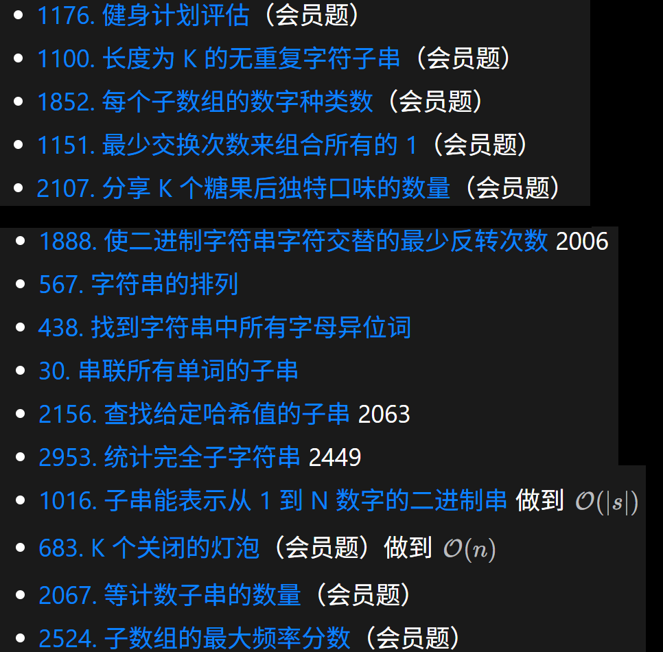

## 分组滑窗【29】

**=>【连续相同分组】<=**

1.【1446】连续字符

2.【3456】找出长度为K的特殊子字符串

3.【1957】删除字符串使字符串变好

4.【1869】哪种连续字符串更长

5.【2038】如果相邻两个颜色均相同则删除当前颜色

6.【2900】最长相邻不相等子序列I

7.【1578】使绳子变成彩色的最短时间

8.【3499】操作后最大活跃区段数I

9.【809】情感丰富的文字

**=>【统计数目-梯形面积】<=**

10.【1759】统计同质子字符串的数目

11.【2348】全0子数组的数目

12.【413】等差数列划分

13.【1887】使数组元素相等的减少操作次数

14.【2110】股票平滑下跌阶段的数目

**=>【连续递增分组】<=**

15.【674】最长连续递增序列

16.【3255】长度为K的子数组的能量II

17.【2414】最长的字母序连续子串的长度

18.【228】汇总区间

19.【1839】所有元音按顺序排布的最长子字符串

20.【3350】检测相邻递增子数组II

**=>【其它分组条件】<=**

21.【3011】判断一个数组是否可以变为有序

22.【2760】最长奇偶子数组

23.【2765】最长交替子数组

**=>【单调性相关 - 状态标记】<=**

24.【3105】最长的严格递增或递减子数组

25.【978】最长湍流子数组

26.【845】数组中的最长山脉

27.【135】分发糖果

**=>【难题】<=**

28.【838】推多米诺

29.【467】环绕字符串中唯一的子字符串

【进阶(还没写)】

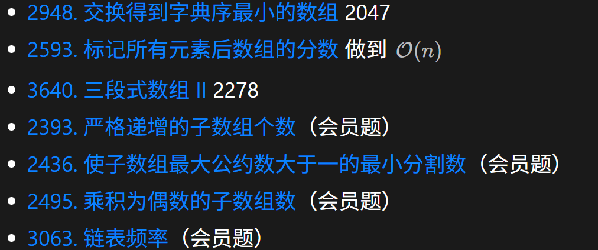

## 变长滑窗【39】

​	越长越合法和越短越合法的意思是：这是由题目的条件决定的，如题目要求子串不包含重复字符的最长子串，很显然字符串越长就越有可能包含重复字符，我们的目的是在不包含重复字符的情况下，找最大值。所以我应该尽可能子串长度变短来满足不包含重复字符的目的。但是一旦满足这个条件，我就尝试更新ans的max。

### 求最值【22】

#### 越短越合法【16】

// **题目一般都会有一个最多的限制条件，这约束着你越短越合法，因为越短越满足那个约束，要求在满足最多约束中寻找最大值。**

**=>【基础题】<=**

1.【3】无重复字符的最长子串

2.【1695】删除子数组的最大得分

3.【3090】每个字符最多出现两次的最长子串

4.【2958】最多K个元素的最长子数组

5.【1493】删掉一个元素后全为1的最长子数组

6.【2730】找到最长的半重复子字符串

7.【2024】考试的最大困扰度

8.【1004】最大连续1的个数III

9.【1208】尽可能使字符串相等

10.【904】水果成篮

**=>【有思维】<=**

11.【1658】将x减到0的最小操作数

12.【2516】每种支付至少取k个

13.【3634】使数组平衡的最少移除数目

14.【2779】数组的最大美丽值

15.【1838】最高频的元素频数

**=>【分组滑动】<=**

16.【2831】找出最长等值子数组

**【进阶题（还没写）】**

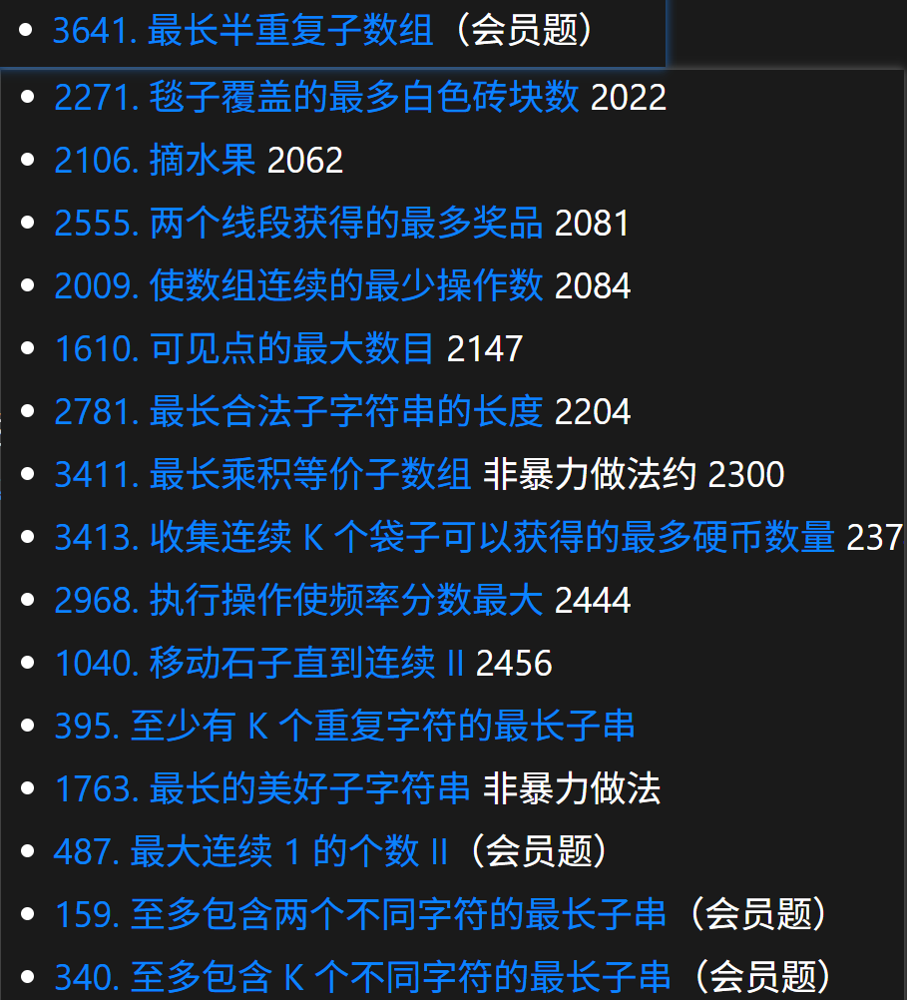

#### 越长越合法【6】

// **越长越合法一般求最短长度，一般题目要求给你一个最少包含xx的限制，因此越长越涵盖这个限制，要求在所有满足条件的情况下寻找最短长度。**

**=>【基础题】<=**

1.【209】长度最小的子数组

2.【76】最小覆盖子串

3.【2904】最短且字典序最小的美丽子字符串

4.【2875】无限数组的最短子数组

**=>【有思维】<=**

5.【632】最小区间

6.【1234】替换子串得到平衡字符串

### 求个数【11】

#### 越短越合法【5】

**=>【基础题】<=**

1.【2302】统计得分小于K的子数组数目

2.【713】乘积小于K的子数组

3.【3258】统计满足K约束的子串的数量I

4.【2762】不间断子数组

5.【LCP 68】美观的花束

**【进阶题（还没写）】**

#### 越长越合法【6】

**=>【基础题】<=**

1.【1358】包含所有三种字符的子串数目

2.【2962】统计最大元素至少出现K次的子数组

3.【3325】字符至少出现K次的子串I

4.【2799】统计完全子数组的数目

5.【3298】统计重新排列后包含另一个字符串的子串数目II

6.【2537】统计好子数组的数目

// 本题把我绕进去了，我终于理解了“子数组元素种等于整个数组元素种类”的内涵了。因为子数组的元素个数就不可能大于整个数组的元素种类k。

**【进阶题（还没写）】**

### 恰好型合法【4】

1.【930】和相同的二元子数组

2.【1248】统计优美子数组

3.【992】K个不同整数的子数组

4.【3306】元音辅音字符串计数II

### 其它【2】

1.【825】适龄的朋友

2.【2401】最长优雅子数组

**【进阶题（还没写）】**

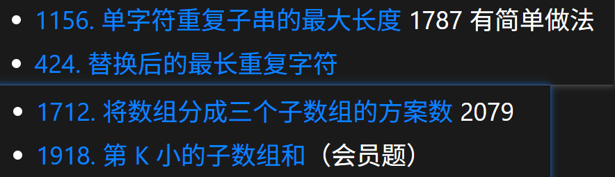

# 双指针【46】

## 面向双指针【23】

**=>【基础题】<=**

1.【344】反转字符串

2.【3643】垂直翻转子矩阵

3.【125】验证回文串

4.【1750】删除字符串两端相同字符后的最短长度

5.【2105】给植物浇水II

6.【977】有序数组的平方

7.【167】两数之和II - 输入有序数组

8.【15】三数之和

9.【18】四数之和

10.【16】最接近的三数之和

11.【1471】数组中的k个最强值

12.【658】找到K个最接近的元素

13.【633】平方数之和

**=>【有思维】<=**

14.【905】按奇偶排序数组

15.【3467】将数组按照奇偶性转化

16.【948】令牌放置

17.【2824】统计和小于目标的下标对数目

18.【LCP 28】采购方案

19.【2563】统计公平数对的数目

20.【611】有效的三角形的个数

21.【1616】分割两个字符串得到回文串

22.【1577】数的平方等于两数乘积的方法

23.【923】多重三数之和

**【进阶题】**

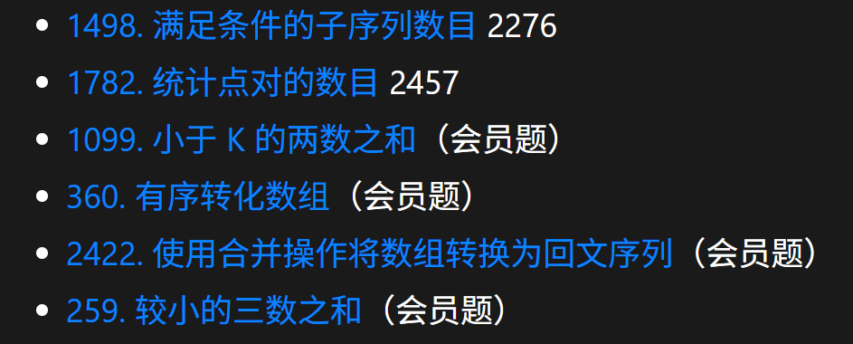

## 同向（快慢）双指针【8】

**=>【基础题】<=**

1.【27】移除元素

2.【283】移动零

3.【2460】对数组执行操作

4.【26】删除有序数组中的重复项

5.【80】删除有序数组中的重复项II

**=>【有思维】<=**

6.【1089】复写零

7.【922】按奇偶排序数组II

8.【75】颜色分类

**【进阶题】**

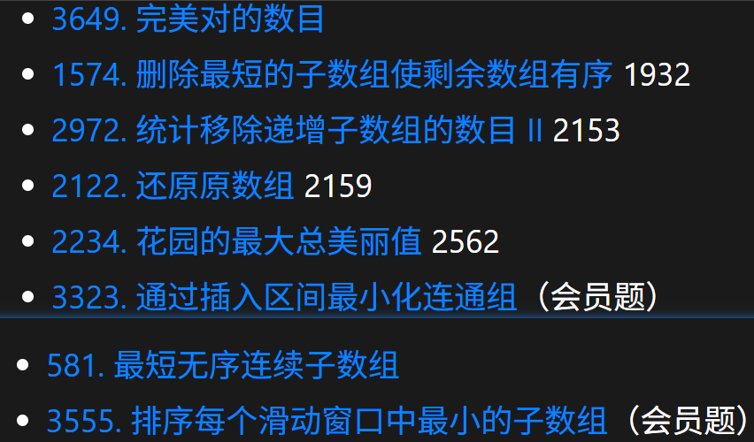

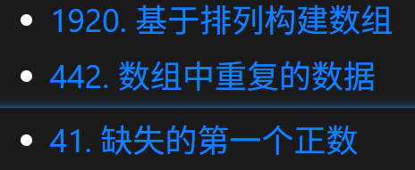

## 双序列双指针【15】

### 判断子序列问题【7】

**=>【基础题】<=**

1.【392】判断子序列

2.【524】通过删除字母匹配到字典里的最长单词

3.【2486】追加字符以获得子序列

4.【2825】循环增长使字符串子序列等于另一个字符串

5.【1023】驼峰式匹配

**=>【有思维】<=**

6.【3132】找出与数组相加的整数II

7.【522】最长特殊子序列II 

### 其它问题【8】

**=>【基础题】<=**

1.【2540】最小公共值

2.【2570】合并两个二维数组- 求和法

3.【350】两个数组的交集II

4.【2109】向字符串添加空格

5.【925】长按键入

**=>【有思维】<=**

6.【LCP 18】早餐组合

7.【1855】下标对中的最大距离

8.【1385】两个数组的距离值

【进阶题】

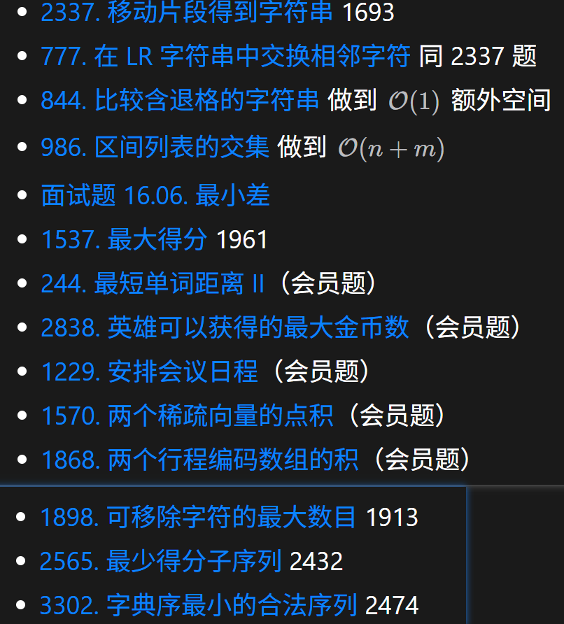

# 其它指针问题【1】

## 三指针

**=>【有思维】<=**

1.【2367】等差三元组的数目 

**【进阶题】**

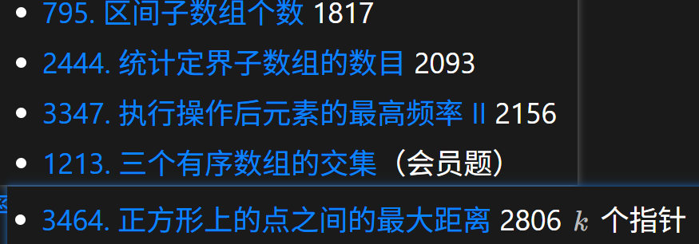

## 背向双指针

**【进阶题】**

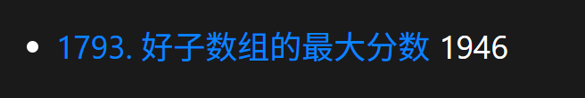

# 单调栈【2】

1.【739】每日温度

2.【42】接雨水

# 每日一题【4】

1.【1323】6和9组成的最大数字 - 【数论】

2.【342】4的幂 - 【数论】

3.【679】24点游戏 - 【回溯】

4.【837】新21点 - 【DP】

# 总结【130+】

​	灵神的滑窗和双指针章节入门就暂时告一段落，本两周一共142道题目，不乏做过的题目有新的思路和理解，也汇总进来了，差不多有130+，做一个简单的总结。【第六周也突破了300题，附截图】

​	滑动窗口和双指针非常适合解决数组的问题。

* 滑动窗口适合解决子数组或子串的问题，对于求最长/最短子数组长度和子数组个数问题尤为合适，部分题目需要经过排序等转化之后才能用滑动窗口；对于首尾卡牌问题或部分循环数组问题，优先考虑逆向思维，其次考虑拷贝一份数组的解决方案；分组循环滑窗类似于经典滑窗，你也可以理解为双指针，但我更喜欢把它称之为分组滑窗，因为它的流程是隐式的滑窗。

* 双指针尤其对双序列好用，对于子序列的判断问题我们可以dp，也可以双指针，优先双指针，而其它子序列问题，则使用dp比较合适。

   最后，感谢坚持的自己！！！进阶的时候，我还会回来的。

   ​									                          ==  2025年8月19日16:47:47

附（突破300+）：

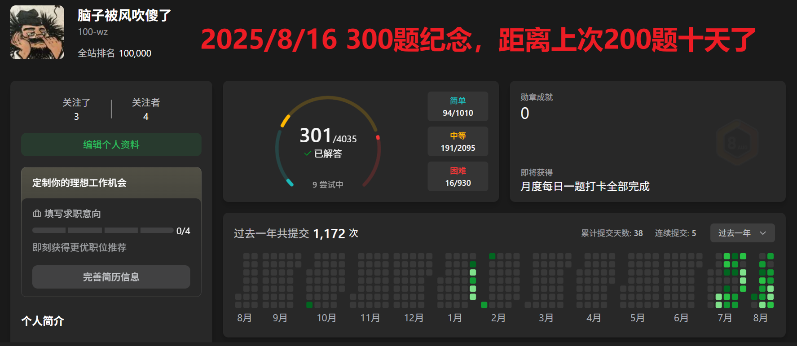

