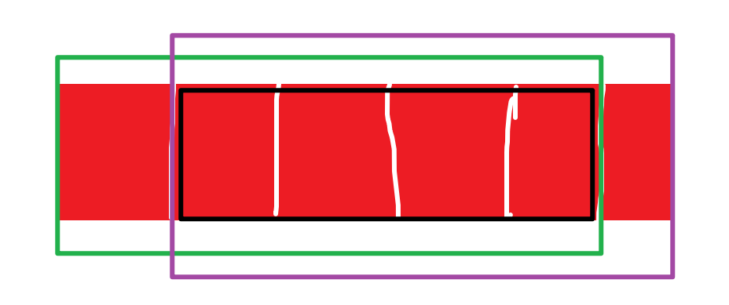
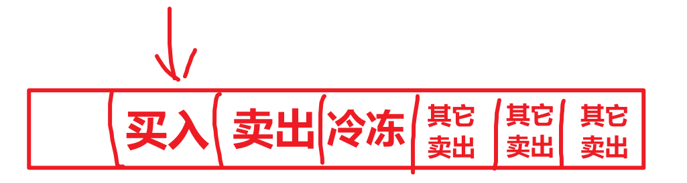

// 【这一次，只刷leetcode】跳过去：karl网-57爬楼梯

// 一维数组解决0-1和完全背包，谁用谁爽；

# dp【36】

==================7.18=============

## 开胃菜【5】

1.【509】斐波那契数

​	注意考虑n很小的时候，考虑好边界，让代码更严谨；

2.【70】爬楼梯

3.【746】使用最小花费爬楼梯

4.【62】不同路径

5.【63】不同路径2

## 背包问题【8】

-- 开始学习！！！都没手感了！！！

### 0-1背包理论基础

-- 背包问题只是一个模型，不是具体题目

​	①问题描述：给n个物品的重量和价值数组，背包容量为C，0-1背包问题是指的是在每一个物品只用一次的情况下，求背包能装下的最大价值。

--因为我们已经学过，我们只重复思考几个关键的点

1）dp数组用一维还是二维？dp数组的含义以及如何定义？

​	dp数组求谁设谁，故含义是最大价值；dp旨在缩小量，依赖于小值和递推公式构造整张表；可以缩小的量有背包容量和物品数量；所以有两个维度，一个维度是物品下标i，一个维度是背包容量j，即`dp[i][j]` 表示[0:i]为待装物品集合时，容量为j的背包可以装得下的最大价值。初始想法一定是二维，至于一会能否压缩状态简化为一维是优化问题。

2）状态转移方程？

​	对于一个物品，我们可以选择装，还是不装。这就奠定了转移方程的核心思路；对于`dp[i][j]`,一定要时时刻刻思考dp的含义；如果不装，背包容量还是这么大j，面向的物品很显然是需要面向[0:i-1]的，即`dp[i-1][j]`,如果装，则`dp[i][j] = nums[i] + xxx`  那到底要加谁呢？这个物品已经装过了，所以需要排除它，从物品上和容量上都要exclude。即`dp[i][j] = nums[i] + dp[i-1][j-nums[i]]` ;这两种情况，我不知道谁的价值最大，所以取max；也可以看出，某一个dp的构造只是依赖于上一行，所以一维dp完全够用了。

3）遍历顺序，先遍历物品还是容量？

​	可以看到，外层的i可以省略，即一维dp即可；两层for循环；很显然由上面的分析可知，i是物品，所以外层遍历物品；内层遍历容量；

​	思考一个关键问题：容量的遍历顺序是正向的还是逆向的；物品没有先后顺序，所以都可以，为了省事，我们正向遍历物品，而且不需要物品的下标，所以我们用简化for遍历即可；而内层的容量，因为一个物品只可以用一次；我们用dp构造表，内部的细节我们是不知道的；所以我们只能保证当前构造的dp不依赖于之前可能用过该物品的状态-如果这样就允许了一个物品用多次；假设容量正向遍历，那么后面的容量依赖于前面的容量构造，假设前面的dp的产生已经使用过一次物品i，那么后面还可能继续使用物品i，这就是完全背包问题-一个物品可以使用多次；假设逆向遍历，即对一个物品i，先构造后面的dp，这样前面的dp不管怎么样，都不“含有”装过物品i的嫌疑；就确保了使用一次。

4）如何初始化？

​	dp初始化为C + 1列即可，不难写出下面的代码；

题目：卡码网： [46. 携带研究材料（第六期模拟笔试）](https://kamacoder.com/problempage.php?pid=1046)

```c++
#include <bits/stdc++.h>

using namespace std;

int maxValue(vector<int>&weight,vector<int>&value,int N) {
	int M = weight.size();
	vector<int> dp(N + 1,0);
	for(int i = 0;i < M;i++) {
		for(int j = N;j >= weight[i];j--) {
			dp[j] = max(dp[j],dp[j-weight[i]]+value[i]);
		}
	}
	return dp[N];	
}
int main() {
	int M,N;
	
	cin>> M >> N;
	vector<int> weight(M,0);
	vector<int> value(M,0);
	
	for(int i = 0;i < M;i++) {
		cin>>weight[i];
	}
	
	for(int i = 0;i < M;i++) {
		cin>>value[i];
	}
	
	cout<<maxValue(weight, value, N);
    
    return 0;
}
```

反思：

* 不要把代码复杂化，能一维决不二维；
* 不会就要学，代码就是复现 - 实践 - 复现的过程，很多题目刷多了就自然会了，好久过去写不出来很正常；多刷几次就可以了；

### 练习

1.【416】分割等和子集 - 能否装满

2.【1049】最后一块石头的重量II - 尽量装满

3.【474】一和零 - 两个重量维度最多装多少个

​	这个题有一共三个维度，相当于两个背包，所以压缩后的状态是二维数组；三层for循环；问题是最大子集的长度，其实就是问背包里面的物品数量；核心是状态转移方程：`dp[j][k] = max(dp[j][k], dp[j-convert(strs[i]]).first][k-convert(strs[i]]).second]+1);` 所以这个题目就简单了，核心还是理解状态转移方程怎么推出来的，都是根据dp的语义来推的。ac了。

4.【494】目标和 - 有多少种装满的方法

​	这个题的状态转移方程比较容易想出来，就是装和不装的方法数相加；难点在于一些细节。

​	题目要求构成一个算式，算式有正数，还有负数，加起来才是target，所以并不是说target是bagsize，而是需要算出来的；拿相当于正数，不拿就是负数，正数和负数相加为target，即Σ~+~ - Σ~-~ = target，而Σ~+~ + Σ~-~ = sum我可以算出来；所以自然可以把Σ~+~即bag_size解出来，就转换为正常的背包问题了。

​	考虑细节：如果你算出来bg_size不是正整数，说明无解；这就可以引出一些出口了； 显然sum = （target + sum） / 2，这要求二者必须是同奇偶；还要求target不能太极端，如果都拿都满足不了，或者都不拿也满足不了都不想，必须要求abs(target) <= sum才可以。

### 完全背包理论基础

​	在讲解0-1背包的时候说过原理了，和0-1背包不同的是一个物品可以被多次使用，所以只需要改变一下遍历顺序即可，从小到大遍历容量，但是太小也不行，所以应该从nums[i]开始遍历。

练习：[52. 携带研究材料（第七期模拟笔试）](https://kamacoder.com/problempage.php?pid=1052)

不难写出代码：

```cpp
#include <bits/stdc++.h>

using namespace std;

int maxValue(vector<int>&weight,vector<int>&value,int N) {
	int M = weight.size();
	vector<int> dp(N + 1,0);
	for(int i = 0;i < M;i++) {
		for(int j = weight[i];j <= N;j++) {
			dp[j] = max(dp[j],dp[j-weight[i]]+value[i]);
		}
	}
	return dp[N];	
}
int main() {
	int M,N;
	
	cin>> M >> N;
	vector<int> weight(M,0);
	vector<int> value(M,0);
	
	for(int i = 0;i < M;i++) {
		cin>>weight[i]>>value[i];
	}
	
	cout<<maxValue(weight, value, N);
    
    return 0;
}
```

### 练习

1.【518】零钱兑换II - 完全背包 + 装满的组合数

​	防止int相加情况下超过范围，可以使用uint64_t这种数据类型，当成int用即可；

2.【377】组合总和 Ⅳ - 完全背包 + 装满的排列数

​	这个题叫做组合总和，但是根据样例来看，算的是排列数；排列数对于一种组合，还有更多的选择，顺序不一样也不同；如何才能不忽略顺序的作用呢；我们现在的代码是这样的：

```cpp
class Solution {
public:
    int combinationSum4(vector<int>& nums, int target) {
        vector<uint64_t> dp(target+1,0);
        dp[0] = 1;
        for(int i = 0;i < nums.size();i++) {
			for(int j = nums[i];j <= target;j++) {
				dp[j] += dp[j-nums[i]];
			}
		}
		return dp[target];
    }
};
```

​	我们的外层遍历的是物品，这就导致一个物品只会遍历一次，即一个物品只会对构造一个dp产生一次影响；但是如果把物品放在内层，那么在构造每一个dp的时候，都会遍历所有的物品，必然导致不同顺序的组合-即排列。

```c++
class Solution {
public:
    int combinationSum4(vector<int>& nums, int target) {
        vector<uint64_t> dp(target+1,0);
        dp[0] = 1;
        for(int j = 0;j <= target;j++) {
        	for(int i = 0;i < nums.size();i++) {
        		if(j >= nums[i]) {
					dp[j] += dp[j-nums[i]];
				}
			}
		}
        
		return dp[target];
    }
};

```

3.【322】零钱兑换

​	细节：主要算min，初始化一般都是INT_MAX，考虑+1越界，所以用uint64_t，然后最后注意的是返回-1（如果还是INT_MAX）,处理一下即可。

4.【279】完全平方数

​	只要是总和为target的问题的相关问题，问的是最多最少多少种类等问题，都是dp问题；这里我们先构造一个nums数组；然后转化为背包问题，由样例可知，是完全背包；求的是最少的物品数量。

​	唯一注意的是初始化，问的是最少物品数量，如果n为0（虽然实际上这不可能，但是我们要依赖于这个值），则不需要拿物品，所以为0。

### 后续

​	由于多重背包问题还没有在leetcode上发现题目，所以就pass过去。

## 打家劫舍问题【3】

1.【198】打家劫舍

​	最开始我们肯定知道是偷还是不偷一个房子是核心的状态转移，问题是具体怎么落实，这个是核心思维，要学习和复习的：如果第i个房子偷，那么就是dp[i-2] + nums[i]，如果不偷，那就是dp[i-1]；求max即可；这就是核心，这和背包问题的思维方式是一样的；需要锻炼这种意识。其它没有问题，直接ac，初始化可以先不着急，先搭架子，在写状态转移方程的时候就知道如何初始化了。

================7.19=============

2.【213】打家劫舍II - 环形dp

​	这个题的思路还是有点难的，区别是房子成环了，区别是第一个房子和最后一个房子是相邻的，那就在考虑的时候把他俩分开就好。



​	即分为三种情况，如图绿色、紫色、黑色所示，即把环形拆成了三种线性并取最大值即可解决问题。这里考虑了三种情况，注意考虑不一定是一定选择边界；而且黑色的情况是可以被包含在绿色或者紫色的情况中的，所以只需要分两种情况即可；我们需要把线性的打家劫舍写出来，然后算绿色和紫色两种情况并求max即可。

​	这种算法忘记了就要复习，不然自己真想不出来。

3.♥【337】打家劫舍 III - 树形dp

​	暴力递归会超时（因为会大量重复计算），还是得用dp。这个也不好想，还是得理解别人的做法；树形dp就要利用树的递归特性；考虑一个根节点，我可以偷，也可以不偷；树状dp就是对于树的每一个根结点，返回一个数组，这里是数组是一个元素是2的数组，下标0表示不偷，下标1表示偷；

​	可以运用后序遍历，先把左右孩子的偷和不偷的数组找出来，然后分析自己，如果不偷自己，那么左右子树都是可以选择偷和不偷的，那么左子树的偷和不偷求max，右子树的偷和不偷求max，加起来就是不偷cur 的情况；如果偷自己，那么左右孩子就不能考虑偷；那就只能用左孩子的不偷 + 右孩子的不偷 + cur->val即可。

​	有了思路，试着写一个代码，ac了；关键是要记住这个树状dp的递归返回值是一个偷和不偷的情况；然后利用递归为每一个结点都构造这样的一个数组，而不是像数组那样直接上来就构造一个大dp数组。


## 买卖股票问题【6】

1.【121】买卖股票的最佳时机 - 只可以买卖一股

​	已经忘完了，学一下思路；

​	买卖股票问题需要记录第i天持有股票和不持有股票的现金数量，所以需要一个    `dp[i][0]` 和`dp[i][1]`，其中    `dp[i][0]`表示第i天持有股票的最大现金，`dp[i][1]`表示第i天不持有股票的最大现金；因为只有这样，我们才可以推得最后一天不持有股票的最大现金数（因为只能买卖一次，所以不持有一定比持有的钱来得多）。

​	递推公式：显然    `dp[i][1]`和`dp[i][0]` 都需要算出来，如果是不持有股票，可能前一天就不持有股票，即继承前一天的不持有；也可能是今天卖出的；同理，如果算持有股票，可能昨天就持有，也可能今天才买入，分别求max即可。初始化：由递推公式可知道，都是由左侧的状态推得，所以正向遍历即可；把第一天的初始化一下即可。

​	ac了。

2.【122】买卖股票的最佳时机II - 可以买卖多股

​	这个是允许整个流程可以买卖多次，但是我们思考一下，同一天卖出再买入是没有意义的；所以这几个段买卖过程应该是没有交集的，即我们假设不会同一天买卖同时发生。

​	买卖多股就意味着我在后续买入股票的时候，我手里不是0现金开始算的，而是基于一定的现金的。这就是唯一区别。ac了，区别就在于持有股票的时候的递推公式略有不同。

3.【714】买卖股票的最佳时机含手续费 => 多次买卖 + 手续费

​	在多次买卖的基础上，每次卖出的时候扣掉一次手续费即可。

4.♥【123】买卖股票的最佳时机III - 最多买卖两股

​	这个题最多买卖两股，所以我们设置四个状态，即第一次持有股票，第一次不持有股票，第二次持有股票，第二次不持有股票，内层是四个元素的dp数组；然后分析方法就是一样的。关键是要想到把这两股化作是四种状态来分别dp。 **唯一要注意的地方是持股的时候的第二个比较的参数是基于谁-prices[i]的**。

5.【188】买卖股票的最佳时机IV - 最多买卖k股

​	这个题和上面123题类似，只是改为了k股，那么就需要你用循环处理了。我们基于上面的代码改进一下。唯一要注意的不同点是第一股的dp数组更新的时候要额外注意。因为第一股持有可能上一天就持有这一股，也可能今天买入的，**<u>但是如果是第一股，就需要从0开始-prices[i]</u>**；如果是非第一股的其它股，就需要注意，要从**<u>上一股昨天不持有</u>**的状态开始-prices[i]. 所以这里要写一个if-else.

6.♥【309】最佳买卖股票时机含冷冻期 - 多次买卖股票 + 冷冻期

​	这个题有冷冻期，所以状态还不一样；不能简单的认为是多次买卖股票然后递推公式简单修改一下即可，而是要把状态数找到。

​	有持有状态、不持有状态两种大的状态，还有冷冻期，冷冻期也算不持有，那么就需要把不持有继续拆分，不持有还包含今天卖出，第二天的冷冻期和一般不持有三种状态。简单说就是持有、今天卖出、冷冻、其它卖出状态四个状态。试着写一下代码。

反思：还有一些理解不到位



* 递推公式：①买入（持有）：今天的持有，可能昨天也是持有状态，或者昨天是冷冻、其它卖出（只能是这两种情况）的最大值，然后减去prices[i]；   ②今天卖出：今天卖出，昨天一定持有，比较easy； ③冷冻：昨天一定是卖出，而且值等于昨天卖出的状态； ④其它卖出：可能昨天也是其它卖出，或者是冷冻期；
* 误解：不要认为今天卖出和冷冻期和其他卖出是等值的，这三个是不同的状态；要根据语义筛选状态，而不是盲目地认为他们三个一样。
* 返回：最后肯定是不持有股票利润更多，但是最后一天可能是今天卖出，也可能是冷冻期，也可能是其它卖出状态，三个状态取max，**<u>千万不要误认为最后一天这三个状态等值</u>**，这三个状态的推出方式都不一样，不是等值的。要取三者的max。

## 子序列\子串\子数组问题【12】

1.【300】最长递增子序列

​	比较简单，两层for循环，外层负责构造dp[i]，内层遍历0到i-1，看比谁大，就在它的dp上+1，然后和自己迭代比较求max即可。注意初始化都为1即可。

​	还有一个很关键的点，很多题目场景中，dp有两种定义方式，一种是面向结果的，结果问的是最长递增子序列的长度，那dp就是面向整个数组的最长xx的长度，就是结果；还有一种dp[i]必须包含下标为i的元素的最长递增子序列的长度，但是包含最后一个元素的不一定是最长递增子序列，所以需要最后再在所有dp值中求max。

​	我们的思路适用于第二种，即在构造dp的过程中，我们用nums[i]去比较，就注定了当前的dp[i]的产生一定是包含了nums[i]。而包含nums[nums.size()-1]的递增子序列不一定是最长的，所以才有了最后求max的操作。

2.【674】最长连续递增序列  => 最长递增子数组的长度

​	我们还是采用包含最后一个研究对象的方式求；这个由于是连续的，所以只需要判断和挨着的就可以，不需要遍历内层了；但是最后还是要求dp的max的。

3.【718】最长重复子数组

​	直接ac了，子数组的问题，不管是之前的最长递增子数组还是最长公共子数组，都是一样的思路；都需要构造以xx结尾的长度，然后最后找max。是不是重复无非就是最后比较是否相等，若不相等，则应该为0；

======================7.20============================

1.【1143】最长公共子序列

​	注意的点是初始化的部分，即第一列和第一行，要结合dp的含义初始化。

2.【1035】不相交的线

​	转化一下就知道求的是最长公共子序列问题。代码和上面类似。

3.【53】最大子数组和

​	这个我觉得有点难。首先，子数组问题一定是最后求max的，所以dp的定义是包含当前的nums[i]的子数组的和；dp[i]只能由两个方向推出来，一种就是前面的dp + nums[i]，一种就是从自己开始，两者求max即可知道应该怎么做。
递推公式如下：`dp[i] = dp[i-1] <= 0 ? nums[i] : dp[i-1] + nums[i];`,即如果前面的dp是负数，那就从当下开始，如果前面的dp是正数，那就带上，反正自己都要加上的。最后求max，看以谁为结尾的子数组的和最大。

4.【392】 判断子序列

​	这个题的难点在于：①写题目之前先看数的范围，如是否从0开始的，用于一些细节，提前return等，要有这个意识。 ②第二个就是一旦发现相等，并且前面也是true，那么既可以直接手动把后面的t的dp都设置为true，并提前break出内层循环。

5.♥【115】不同的子序列

​	有点难，没啥思路。

​	这里我要说一点，和最长公共子序列的区别是这里是求s包含多少个t子序列，求的是个数；我们姑且假设s一定包含t；为什么会出现多个的情况？就是因为有一些字母是连续重复，可能重复两次或更多次，这也是求解问题的关键。

​	双串匹配问题的核心思路是比较s[i]和t[j]：如果相等，那么 `dp[i][j]`当然要包含大家都回退一步的个数，即
`dp[i-1][j-1]`,但是核心我们说了是s串中的字母可能重复，如bagg和bag匹配，g和g相等，bag和ba要匹配，但是不全，bag和bag也要匹配，这就意味着s[i]分为考虑和不考虑两个部分，正是因为s串中的字母可能重复（重复多次会被循环考虑，所以只需要讨论循环两次的情况，假设是baggg，那么前面两个g都在之前的dp逻辑中已经被处理过了），才导致有多个子序列t，而第一部分`dp[i-1][j-1]`是考虑s[i]的情况（考虑即让s[i]参与了比较），如果不考虑s[i]，那么这部分个数就是`dp[i-1][j]`,那么这部分dp已经被计算过了。

​	如果不相等，那么就不会考虑s[i]了，即   `dp[i-1][j]`，试着写一下代码吧。ac了。

​	注意大整数相加会溢出，以后只要出现这种会溢出的，用uint_64. 再就是第一列初始化的时候不需要break，这是根据业务理解得到的。

6.【583】两个字符串的删除操作 - LCS问题的变形。

==========================7.21===========================

1.【72】编辑距离

​	这个就没有办法用LCS解决了，是双串问题，核心还是比较word1[i]和word2[j]的关系；首先问什么设什么，
即`dp[i][j]`表示的是word1的[0:i]和word2的[0:j]的最小编辑距离；那么如果说word1[i]和word2[j]相等，那么就不需要操作，即`dp[i][j]=dp[i-1][j-1]`，相当于这两个不需要考虑了；如果不相等，要么word1删除一个元素，要么word2删除一个元素（一个删除相当于另一个插入），这两种的dp要求min；还可以替换一次，让i和j对应的元素相同，假设已经相同，则二者都可以不考虑，所以在替换的情景下，`dp[i][j] = dp[i-1][j-1] + 1;`  三种操作求min即可得到递推公式。

​	写一下代码吧，ac了，主要是思路要学，初始化麻烦点，但是耐住性子。

2.【647】回文子串

​	回文子串问题比较特殊，它问的是所有回文子串的数量，如果用暴力，双指针判断回文串是O(n)，遍历所有子串是O(n^2^)，所以整体是O(n^3^);既然要统计个数，就必然要遍历所有的子串，那么我们能不能减少重复计算（判断是否回文），因为判断回文时，重复调用isHui存在大量重复计算，dp旨在记忆化过去计算的结果，利用已经确定的结果在O(1)的复杂度下，推得陌生的情况。对于一个子串s，根据回文串的性质，如果我们知道[i,j]范围是否为回文串，那么根据s[i-1] == s[j+1]的情况，就可以知道[i-1,j+1]是否回文。

​	很显然，dp应该设为i、j两个维度，而且是bool值；而且 i<=j 是必然的，所以矩阵填充的时候是上三角；遍历的时候应该是往右上角推，所以从左下角开始遍历；递推公式是`dp[i][j] = dp[i+1][j-1] and s[i] == s[j]`  初始化应该把对角线初始化为true即可；一遍遍历以便统计cnt即可。

​	细节①：关键就是如何在循环层面实现左下角往右上角遍历，外层的i控制行，要从大数往下--，内层的j要从i+1开始往右侧遍历就可实现；前提是你要先初始化对角线；然后这样就可以遍历上三角了；

​	细节②：这里既然对角线是提前初始化的，所以cnt的初始值也要设置为n，而不是0。

​	细节③：我的递推公式无法覆盖到j == i+1的情形，所以在   `s[i] == s[j] and dp[i+1][j-1]` 这个and后面要加上一个条件，即`s[i] == s[j] and （j == i+1 or dp[i+1][j-1]）` 

3.【516】最长回文子序列

​	ac了，但是细节很多。

​	①初始化，一定要确保都是1，因为最后的max_dp至少也是1.对角线也应该初始化为1，对于回文的问题，我们肯定采用二维数组来处理，而且遍历顺序都是从正对角线往右上角遍历的，而且max_dp是随着构造而比较迭代出来的。

​	②状态转移：我们的dp的定义是字符串[i:j]区间的最大回文子序列的长度，而不是一定要包含头和尾巴的；如果相等，那就可以直接缩减dp + 2（不需要区分j == i+1这种，因为包含进去了，前提是下三角初始化为0才可以）；如果不相等，这里也要处理，即要不考虑随便一个，然后取max即可，注意不考虑的时候，dp的缩减方向问题，这取决于遍历方向。

# 贪心

-- 贪心算法我也是学习的，没有上来就很有思路。

1.【134】加油站

​	本题的贪心思路是：先算出一个rest数组，证明每一站跑到下一站能剩余的油量，从某一个站点0开始跑，一直累加rest[i]，一旦发现到j就断油，说明[0,j]这一段都不能作为起点-因为假设到j没有断油，这之前的累加值结果都是正，证明一直有油；到这里断油了，为什么说一定前面的其它站点出发就不行呢。这里就涉及一个数学技巧了。我们假设从i站出发，到j站断油；假设存在一个k站（i < k < j），使得acc[k:j] > 0；由已知条件可以知道，acc[i:k]一定是大于0的，因为没有到k就断油了，这就可以推出acc[k:j] + acc[i:k] > 0，这显然和已知条件矛盾了，所以不存在这样的k。所以只需要从j+1重新遍历即可，整体是O(n)的复杂度。

​	贪心这里还是挺难想到的。第一要想到用净差值来研究，第二就是要想到这个累加的结论：如果j断油，那么i到j都不会是起点。

​	这个题还有一个点，那就是我们使用排除法确定起点的，最后一个站点如何确定的问题，最后一个站点需要用全局是否能跑到确定，全局求和之后如果>=0,说明必然不会返回-1，那就是最后的ret结果。

2.【135】分发糖果

​	不会写 => 本题的贪心思路是：**考虑完左侧再考虑右侧**。不能两边同时考虑，应该先考虑左边，左边确保右侧的孩子如果比左侧评分高，就在左侧的基础上+1；这种趋势确保之后，就需要考虑右边，显然应该从右侧往左侧遍历，如果左侧的孩子的评分比右侧的更高，那么应该在右侧孩子的基础之上+1，但是只是赋值为这还有可能会改变原来和左侧孩子的关系，在处理左侧的时候，我们更新的条件是如果我比左侧孩子要大，我就更新，这确保了比左孩子要更大，假设不更新那我就是1；所以在处理右侧的时候，**我要用原来的值和这次右孩子+1取max**，这样既可以确保比右孩子大，也可以确保比左孩子大；

​	假设左侧的时候没有更新，那也不影响max是右侧孩子+1.所以取max是必要的，确保了比左侧孩子和右侧孩子大（如果确实这样的话）。

​	贪心就贪心在这老师抠抠搜搜的，在满足题干的要求下，能不多出就不多出，通过局部最优推出了全局最优。

3.【860】柠檬水找零

​	太简单了，贪心就在于如果有20的，先考虑用一张10元的再用一张5元的，而不是上来就考虑三个5元，因为5元的功能更强大！

​	一会我要把它放在题单的第一个，实在是太简单了，这个随想录的顺序说实话不是我喜欢的。

4.【406】根据身高重建队列

​	这个题也是两个考虑的维度，一个是身高，一个是前面多少个人比我多，两个变量考虑起来容易顾此失彼，所以我们先按照身高排个序，这样就可以保证我左侧的都比我高，这样再考虑往前插入就不影响后面的，因为反正我和我自己前面的都比后面要大，而且身高排序完毕之后都是往前插的。这样就做到了两个变量一个一个来处理，这个排序也是贪心经常做的一种做法。排序操作也是为了更好的体现出顺序之后实现贪心。从最高的开始插入。

​	所以贪心大多数都离不开排序，不管是物理排序，还是以排序的思路考虑问题。有些题目不需要真的排序，只需要从逻辑上考虑最值实现贪心，有些题需要真的物理排序数组。

**<u>反思</u>**：

* 【仿函数规则】排序问题：①两个维度要考虑按照身高整体降序，也要考虑身高相同的时候如何在仿函数中处理； ②排序做法：CPP中，不是java中的true交换原则，而是相反的；**即 > 表示降序，< 表示正序。** ③传入仿函数的类，要实例化对象，带着括号，而不是像静态方法那样传入函数地址。
* 【vector的insert】vector不需要提前规定好大小，只需要初始化对象之后调用insert即可，insert的语法是具体地址，插入什么；具体地址可以根据begin()加上整数表示具体地址。

========================7.22日==============================

1.【452】用最少数量的箭引爆气球

2.【435】无重叠区间

=> 这两个题类似，我都是直接ac了，区别只是语境不同，计数器++的条件不同，都是最后对齐有边界。

3.【56】合并区间

=> 这个题我的思路很巧妙，注意一个点重叠也要合并；我的思路是如果重叠，就更新当下的区间，左右都要更新，左取min，右取max，然后如果不重叠，才把i-1放入ret中，然后最后不要忘记把最后一个区间放入ret中即可。

4.【763】划分字母区间

=> 也是自己想出来了哈哈，就是合并区间的变式题，你只要能够想到一个字母的出现位置整体是一个区间，就可以想到合并区间了。

5.【55】跳跃游戏

=> 也是区间问题，这种跳跃的问题也可以看做是区间的问题，也可以利用合并区间来写。

6.【45】跳跃游戏 II

​	不会写=> 看了视频的讲解，我懂了，其实就是算区间的覆盖范围，每次只在这个范围内遍历，遍历过程中会拓展我的范围的右边界，每一次启动新的覆盖范围就让result++；拓展范围过程中求的是max。

​	这个过程需要维护两个变量，一个是cover，cover每次都会取max更新，但是下一步的覆盖范围却是到达上次的覆盖范围之后才会启动下一次的cur = cover，也只有这个时候才会检查是不是覆盖到了。这个时候cnt伴随着也会更新。这样的好处是方便统计次数。代码如下：

```c++
for(int i = 0;i < nums.size();i++) {
    cover = max(cover, i+nums[i]);
    if(i == cur and i != nums.size()-1) {
        cur = cover;
        cnt++;
        if(cover >= nums.size()-1) return cnt;
    }
}
```

